# 第一章 绪论

### **一、数据库系统发展进程**

#### **1. 什么是数据库？**

- **定义**：数据库（Database, DB）是**长期存储在计算机内、有组织、可共享、统一管理**的数据集合。
- **技术本质**：数据库技术是一种**数据管理软件系统**，核心目标是通过**数据模型**实现数据的**结构化、低冗余、高独立性、安全共享**。

#### **2. 数据处理技术三个阶段**

| **阶段**    | **应用背景**           | **特点**                   | **优缺点**                        |
| --------- | ------------------ | ------------------------ | ------------------------------ |
| **人工管理**  | 1950年代前，科学计算       | 数据与程序绑定，无独立存储介质          | ✅ 简单直接<br>❌ 数据冗余高、无法共享         |
| **文件系统**  | 1950-1960年代，操作系统支持 | 数据以文件形式独立存储，由文件系统管理      | ✅ 数据物理独立<br>❌ 逻辑独立性低、冗余高、无集中控制 |
| **数据库系统** | 1960年代后，企业级应用需求    | **三级模式结构、数据模型、DBMS统一管理** | ✅ 数据独立、冗余低、完整性约束<br>❌ 系统复杂度高   |

> **关键突破**：数据库系统通过**DBMS（数据库管理系统）** 实现数据与程序的解耦，支持**并发控制、故障恢复、安全机制**。

---

### **二、数据模型**

#### **1. 数据模型定义**

- **核心作用**：抽象描述现实世界数据的**结构、操作、约束**的工具。
- **数据结构化重要性**：消除冗余，确保数据一致性（如避免同一数据在多处存储导致不一致）。

#### **2. 数据模型三要素**

| **要素**   | **说明**                    | **示例（关系模型）**                |
| -------- | ------------------------- | --------------------------- |
| **数据结构** | 数据逻辑结构与存储方式               | 二维表（行/列）                    |
| **数据操作** | 对数据增删改查的规则                | SQL（SELECT, INSERT, UPDATE） |
| **数据约束** | 保证数据正确性的规则（实体/参照/用户定义完整性） | 主键唯一、外键引用有效                 |

#### **3. 概念模型（E-R模型）**

- **特点**：面向用户，与具体DBMS无关，描述**实体、属性、联系**。
- **核心概念**：
  - **实体**（Entity）：独立对象（如“学生”）
  - **属性**（Attribute）：实体特征（如“学号”、“姓名”）
  - **码**（Key）：唯一标识实体的属性集（如“学号”是学生实体的码）
  - **联系**（Relationship）：实体间关联（1:1、1:n、m:n）
    - **示例**：学生（m）—— 选修（n）—— 课程 → **m:n联系**

#### **4. 关系数据模型（Codd模型）**

| **要素**   | **内容**                          |
| -------- | ------------------------------- |
| **数据结构** | 二维表（关系）                         |
| **数据操作** | 关系代数（选择、投影、连接） + SQL            |
| **数据约束** | 实体完整性（主键非空）、参照完整性（外键有效）、用户自定义约束 |
| **优点**   | 结构简单、数学基础坚实（集合论）、数据独立性高         |
| **缺点**   | 复杂查询效率低（需优化）、语义表达能力弱于对象模型       |

> **ER图示例**：  
> 
> ```
> [学生] ---<选修>--- [课程]  
>  |（学号 PK）        |（课程号 PK）  
>  | 姓名              | 课程名  
> ```

---

### **三、数据库系统结构**

#### **三级模式两级映像**

| **层级**  | **作用**                     | **映像机制** | **关键意义**                |
| ------- | -------------------------- | -------- | ----------------------- |
| **外模式** | 用户视图（子模式），定制数据访问权限         | 外模式/模式映像 | **逻辑数据独立性**（模式改，外模式可不变） |
| **模式**  | 全局逻辑结构（所有数据的逻辑定义），         | 无        | 数据库设计的核心蓝图              |
| **内模式** | 存储/物理模式，物理存储结构（文件、索引的存储方式） | 模式/内模式映像 | **物理数据独立性**（存储改，模式可不变）  |

**外模式定义:** 数据库用户能够看见和使用的局部数据的逻辑结构和特征。

**模式定义:** 所有用户的公共数据视图。

**内模式定义:** 对数据物理结构和存储方式的描述，是数据在数据库内部的组织方式。


> **实际应用**：  
> 
> - 修改表结构（模式）时，通过**外模式/模式映像**调整视图，应用程序无需修改。  
> - 更换存储引擎（内模式）时，通过**模式/内模式映像**保持逻辑结构不变。

---

### **四、数据库系统组成**

| **组件**     | **功能说明**                                                                   |
| ---------- | -------------------------------------------------------------------------- |
| **硬件**     | 存储设备（磁盘/SSD）、内存、处理器                                                        |
| **软件**     | **DBMS核心**（查询处理、事务管理、存储引擎）、开发工具、应用程序                                       |
| **用户**     | DBA（管理）、程序员（开发）、终端用户（使用）                                                   |
| **数据库**    | 实际存储的数据集合                                                                  |
| **DBMS模块** | - 数据定义（DDL编译器）<br>- 数据操作（DML编译器/查询优化）<br>- 运行控制（并发/恢复/安全）<br>- 实用程序（备份/导入） |

---

### **五、数据库对象**

#### 数据库对象操作支持表

| 数据库对象                   | 创建  | 删除  | 修改  | 说明                          |
| ----------------------- | --- | --- | --- | --------------------------- |
| **表 (TABLE)**           | ✓   | ✓   | ✓   | `CREATE/DROP/ALTER TABLE`   |
| **视图 (VIEW)**           | ✓   | ✓   | △   | 修改需`CREATE OR REPLACE VIEW` |
| **索引 (INDEX)**          | ✓   | ✓   | ✗   | 修改需删除重建                     |
| **模式 (SCHEMA)**         | ✓   | ✓   | △   | `CREATE/DROP SCHEMA`，修改有限   |
| **域 (DOMAIN)**          | ✓   | ✓   | ✓   | 用户自定义类型约束                   |
| **约束 (CONSTRAINT)**     | ✓   | ✓   | △   | 通过`ALTER TABLE`增删           |
| **字符集 (CHARACTER SET)** | ✓   | ✓   | △   | 元数据对象                       |
| **排序规则 (COLLATION)**    | ✓   | ✓   | △   | 字符串比较规则                     |
| **触发器 (TRIGGER)**       | ✓   | ✓   | ✗   | 修改需删除重建                     |
| **存储过程 (PROCEDURE)**    | ✓   | ✓   | △   | 修改需`CREATE OR REPLACE`      |
| **函数 (FUNCTION)**       | ✓   | ✓   | △   | 修改需`CREATE OR REPLACE`      |
| **序列 (SEQUENCE)**       | ✓   | ✓   | ✓   | 数字序列生成器                     |
| **角色 (ROLE)**           | ✓   | ✓   | △   | 权限分组                        |
| **用户 (USER)**           | ✓   | ✓   | ✓   | 访问账户管理                      |
| **权限 (PRIVILEGE)**      | ✓   | ✓   | ✗   | 通过`GRANT/REVOKE`管理          |

##### 关键符号说明

- ✓：支持标准操作（有专用DDL语句）
- △：部分支持或需间接操作
- ✗：不支持直接操作

##### 补充说明

1. **修改操作限制**：
   
   - 视图/函数/存储过程通过替换实现修改
   
   - 索引/触发器需删除后重建
   
   - 约束通过`ALTER TABLE`管理
     
     ```sql
     -- 示例：约束操作
     ALTER TABLE t ADD CONSTRAINT pk PRIMARY KEY (id);  -- 创建
     ALTER TABLE t DROP CONSTRAINT pk;                 -- 删除
     ```

2. **特殊对象**：
   
   - **目录 (CATALOG)**：物理存储单元，通常不支持直接修改
   - **转换 (TRANSLATION)**：字符集映射，支持`CREATE/DROP`但无修改
   - **断言 (ASSERTION)**：全局约束，标准中定义但多数DBMS未实现

3. **扩展对象**（部分DBMS支持）：
   
   - 物化视图 (MATERIALIZED VIEW)
   - 表空间 (TABLESPACE)
   - 分区 (PARTITION)
   - 策略 (POLICY) 等

---

### **六、数据库访问过程**

**典型流程**：  

1. 用户提交SQL查询 → 2. 语法分析 → 3. 查询优化（选择执行计划） → 4. 执行引擎访问存储管理器 → 5. 缓冲区管理器读写磁盘 → 6. 返回结果。  
   **关键机制**：  
- **缓冲区管理**：减少磁盘I/O（内存缓存热点数据）  
- **事务管理**：ACID特性保障（原子性，一致性，隔离性，持久性，见第11章）  

---

### **七、数据库系统核心优势**

1. **数据结构化**：全局统一模型（如关系表），消除文件系统的分散存储问题。  
2. **数据共享**：多应用并发访问同一数据集（如银行系统支持柜台/ATM/网银）。  
3. **数据独立性**：  
   - **物理独立**：调整存储结构不影响应用。  
   - **逻辑独立**：修改全局逻辑结构（如新增字段）可通过视图屏蔽。  
4. **数据安全**：权限控制（用户级/角色级授权）。  
5. **完整性保障**：约束（如年龄>0）、触发器。  
6. **故障恢复**：日志机制（WAL）、备份还原。  
7. **数据一致性**：事务的原子性/隔离性（如转账操作要么全执行要么全回滚）。  

> **案例**：  
> 银行系统中，数据库确保：  
> 
> - 转账时A账户扣款与B账户加款**原子性**（一致性）  
> - 高并发时数据不冲突（隔离性）  
> - 服务器宕机后通过日志**恢复**至一致状态  

---

**复习建议**：  

- 重点理解**三级模式映射如何实现数据独立性**（常考简答题）。  
- 对比**文件系统 vs 数据库系统**的优劣（论述题高频考点）。  
- 熟练绘制**E-R图**（实体/属性/联系的表示规范）。  
  
  

# 第二章 关系数据库

---

### **一、关系数据结构**

#### **核心概念定义**

| **术语**        | **定义**                                                   | **示例说明**                                            |
| ------------- | -------------------------------------------------------- | --------------------------------------------------- |
| **域（Domain）** | 一组具有相同数据类型的值的集合                                          | 性别域：{‘男’, ‘女’}；年龄域：{18,19,20}                       |
| **笛卡尔积**      | 域的有序组合集合 $` D_1 \times D_2 \times \cdots \times D_n `$   | 域A={1,2}，域B={‘a’,‘b’} → 积：{(1,a),(1,b),(2,a),(2,b)} |
| **基数**        | 域中元素的个数                                                  | 域A的基数=2                                             |
| **关系**        | 笛卡尔积的子集（即满足语义的元组集合）                                      | 学生表：从“学号×姓名×年龄”的积中选取有效数据                            |
| **候选码**       | 能唯一标识元组的最小属性集（无冗余属性）                                     | 学生表的<u>学号</u> 或 <u>身份证号</u>（若均唯一）                   |
| **主码**        | 从候选码中选定的唯一标识符（Primary Key, PK）                           | 选定<u>学号</u>作为主码                                     |
| **全码**        | 所有属性组合才能唯一标识元组（罕见）                                       | 考试表：<u>学号+课程号+考试日期</u>才能确定成绩                        |
| **外码**        | 一个关系中的属性集，需**引用另一关系的主码**（Foreign Key, FK）                | 成绩表的<u>学号</u>是外码 → 引用学生表的主码                         |
| **关系模式**      | 关系的逻辑结构描述：**R(U, D, DOM, F)** <br>（关系名、属性集、域、属性到域的映射、依赖） | 学生(学号, 姓名, 年龄)                                      |
| **关系数据库**     | 基于关系模型的数据库，由**多个关系** (**表**)组成                           | 教学数据库：学生表、课程表、成绩表                                   |

#### **关系的性质**

1. **列同质**：每列数据类型相同（如“年龄”列全为整数）。  
2. **属性原子性**：属性值不可再分（1NF要求，如不能将“电话”拆为“固话/手机”存于一列）。  
3. **元组唯一性**：任意两行不全相同（主码保证）。  
4. **列无序性**：列的物理顺序不影响语义。  
5. **行无序性**：行的物理存储顺序无关。  

> **反例说明原子性**：  
> 错误设计：`学生(学号, 联系方式(手机, 邮箱))` → 违反1NF  
> 正确设计：`学生(学号, 手机, 邮箱)`  

---

### **二、关系的完整性**

| **完整性类型**    | **规则**                    | **DBMS如何保障**                 | **示例**                   |
| ------------ | ------------------------- | ---------------------------- | ------------------------ |
| **实体完整性**    | **主码属性不可为空（NOT NULL）且唯一** | 主键约束（PRIMARY KEY）            | 学生表的学号不能为空且不允许重复         |
| **参照完整性**    | **外码取值需为被参照表主码的有效值或NULL** | 外键约束（FOREIGN KEY REFERENCES） | 成绩表的学号必须在学生表中存在          |
| **用户自定义完整性** | 用户根据业务逻辑设定的规则             | CHECK约束、触发器                  | 年龄>0，性别∈{‘男’,‘女’}，邮箱格式验证 |

> **参照完整性级联操作**：  
> 
> - `ON DELETE CASCADE`：删除被参照表记录时，自动删除参照表中关联记录。  [**级联**]
> - `ON DELETE RESTRICT`:删除被参照表记录时，拒绝操作并回滚。 [**受限**]
> - `ON DELETE/UPDATE SET NULL`：删除/更新被参照表主码时，参照表外码置空。  [**置空**]

---

### **三、关系代数**

> **符号约定**：  
> 
> - σ：选择（Selection）  
> - π：投影（Projection）  
> - ⋈：连接（Join）  
> - ÷：除（Division）  

#### **1. 传统集合运算（要求：参与运算的关系属性相容）**

| **运算**   | **符号**        | **说明**         | **示例**                                 |
| -------- | ------------- | -------------- | -------------------------------------- |
| **并**    | $R \cup S $   | 合并两关系的所有元组（去重） | 查询所有学生和教师 → $\text{学生} \cup \text{教师}$ |
| **差**    | $R - S $      | 保留属于R但不属于S的元组  | 查询未选课的学生 → $ 学生 - π_{学号}(选课) $         |
| **笛卡尔积** | $R \times S $ | 两关系所有元组的组合     | 生成所有可能的选课组合 → $ 学生 \times 课程 $         |

#### **2. 扩展关系运算**

| **运算** | **符号**       | **说明**      | **示例**                           |
| ------ | ------------ | ----------- | -------------------------------- |
| **选择** | $σ_{条件}(R) $ | 筛选满足条件的行    | 查询年龄>20的学生 → \( σ_{年龄>20}(学生) \) |
| **投影** | $π_{属性}(R) $ | 选取指定列（自动去重） | 查询所有学生姓名 → \( π_{姓名}(学生) \)      |

#### **3. 组合关系运算**

| **运算**   | **符号**         | **说明**                                                           | **示例**                                                                                                        |
| -------- | -------------- | ---------------------------------------------------------------- | ------------------------------------------------------------------------------------------------------------- |
| **交**    | $R \cap S $    | 取两关系的公共元组$` R \cap S = R - (R - S) `$                            | 查询同时选修CS101和CS102的学生 → $` π_{学号}(σ_{课程号='CS101'}(选课)) \cap π_{学号}(σ_{课程号='CS102'}(选课)) `$                     |
| **连接**   | $R ⋈_{条件} S $  | 笛卡尔积 + 选择条件                                                      | 查询学生选课详情 → $` 学生 ⋈_{学生.学号=选课.学号} 选课 `$                                                                        |
| **等值连接** | $R ⋈_{A=B} S $ | 连接条件是“=”（结果保留重复列）                                                | 按学号等值连接学生表和选课表                                                                                                |
| **自然连接** | $R ⋈ S $       | **等值连接 + 去重复列**（自动按同名属性等值连接）                                     | 学生表与选课表按同名属性“学号”自然连接                                                                                          |
| **外连接**  | $R⟗S$          | **内连接 + 两侧表中失配的元组** (把左边R和右边关系S中要舍弃的元组都保留)                       | $R(A,B,C)={(1,1,5),(2,4,6)}$, $S(B,D)={(2,4),(5,8)}$, $R⟗S(A,B,C,D)={(1,1,5,NULL),(2,4,6,4),(NULL,5,NULL,8)}$ |
| **左外连接** | $R⟕S$          | **内连接 + 左侧表中失配的元组**(只把左边关系R中要舍弃的元组保留)                            | 例同上，$R⟕S(A,B,C,D)={(1,1,5,NULL),(2,4,6,4)}$                                                                   |
| **右外连接** | $R ⟖ S$        | **内连接 + 右侧表中失配的元组**(只把右边关系S中要舍弃的元组保留)                            | 例同上,$R⟖S(A,B,C,D)={(2,4,6,4),(NULL,5,NULL,8)}$                                                                |
| **除**    | $R ÷ S $       | 满足：结果关系T，使得 $` T \times S \subseteq R `$（即结果T包含了关系S在R与S公共属性列上投影） | 查询选修了**所有课程**的学生 → $` π_{学号,课程号}(选课) ÷ π_{课程号}(课程) `$                                                         |

#### **关系代数表达式综合示例**

**问题**：查询选修了“数据库”课程的学生姓名。  
**分步推导**：  

1. 获取“数据库”课程的课程号：$`C = π_{课程号}(σ_{课程名='数据库'}(课程)) `$

2. 找出选修这些课程的学生学号： $S = π_{学号}(选课 ⋈ C) $

3. 关联学生表获取姓名： $Result = π_{姓名}(学生 ⋈ S) $
   **完整表达式**：  

$$
π_{姓名}\left( 学生 ⋈ π_{学号}\left( 选课 ⋈ \left( π_{课程号}\left( σ_{课程名='数据库'}(课程) \right) \right) \right)  \right)
$$

---

### **重点总结**

1. **关系完整性**是数据库正确性的基石：  
   - **实体完整性**:主码唯一非空 → 实体可标识  
   - **参照完整性**:外码有效引用 → 表间逻辑一致  
   - **用户定义完整性**:CHECK约束 → 业务规则强制  
2. **关系代数表达式**需掌握：  
   - 选择(σ) + 投影(π) 为基础  
   - 自然连接(⋈) 是最常用连接方式  
   - 除运算(÷) 解决“查询全部”问题  
3. **实战技巧**：  
   - 自然连接 vs 等值连接：前者自动去重列  
   - 除运算等价转换：$`R ÷ S = π_{R-S}(R) - π_{R-S}((π_{R-S}(R) \times S) - R) `$  
     
     

# 第三章 SQL语言

-----

### **一、SQL语言概述**

SQL属于**关系型**数据库语言。

#### **核心特点**

1. **综合统一**  
   
   - 集DDL（数据定义）、DML（数据操纵）、DCL（数据控制）于一体  
   - 操作对象：$`\text{表、视图、索引} `$  

2. **高度非过程化**  
   
   - 用户只需声明"做什么"（如 `SELECT`），无需指定"怎么做"  

3. **面向集合**  
   
   - 操作对象和结果均为元组集合：$`R = \{t_1, t_2, \dots, t_n\} `$  

4. **两种使用方式**  
   
   - 交互式SQL（命令行）  
   - 嵌入式SQL（嵌入Java/Python等程序）  

5. **语法简洁**  
   
   - 核心动词仅9个：  
     $`
     \begin{array}{c}
     \text{CREATE, DROP, ALTER} \\
     \text{SELECT, INSERT, UPDATE, DELETE} \\
     \text{GRANT, REVOKE}
     \end{array}
     `$

---

### **二、数据定义功能**

#### **1. 数据库操作**

```sql
-- 创建数据库
CREATE DATABASE SchoolDB 
  CHARACTER SET utf8mb4 
  COLLATE utf8mb4_unicode_ci;

-- 删除数据库
DROP DATABASE SchoolDB;
```

#### **2. 表操作**

```sql
-- 创建表（含完整性约束）
CREATE TABLE Student (
  Sno     CHAR(9)     PRIMARY KEY,        -- 主码约束
  Sname   VARCHAR(20) NOT NULL,           -- 非空约束
  Ssex    CHAR(2)     CHECK(Ssex IN ('男','女')), -- 检查约束
  Sage    INT         DEFAULT 18,          -- 默认值
  Sdept   VARCHAR(20),
  CONSTRAINT FK_Dept FOREIGN KEY (Sdept) REFERENCES Dept(Dname) -- 外键约束
);

-- 修改表结构
ALTER TABLE Student
ADD COLUMN Email VARCHAR(50);  -- 新增列

ALTER TABLE Student
DROP COLUMN Email;             -- 删除列

-- 删除表
DROP TABLE Student CASCADE;    -- CASCADE级联删除依赖对象
```

#### **3. 索引操作**

```sql
-- 创建索引（加速查询）
CREATE UNIQUE INDEX Idx_Sno ON Student(Sno);  -- 唯一索引
CREATE INDEX Idx_Sname ON Student(Sname);     -- 普通索引

-- 删除索引
DROP INDEX Idx_Sname;
```

> **索引选择原则**：  
> 
> - 主键自动创建唯一索引  
> - 频繁作为 `WHERE` 条件的列  
> - 关联查询的外键列  

---

### **三、数据查询功能**

#### **1. 简单查询**

```sql
-- 投影：查询所有学生姓名和年龄
SELECT Sname, Sage FROM Student; 

-- 选择：计算机系20岁以下学生
SELECT * FROM Student 
WHERE Sdept='CS' AND Sage<20;

-- 去重：查询所有系名
SELECT DISTINCT Sdept FROM Student; 

-- 排序：按年龄降序
SELECT Sno, Sname FROM Student 
ORDER BY Sage DESC;
```

#### **2. 嵌套查询（子查询）**

```sql
-- 不相关子查询：查询与"刘晨"同系的学生
SELECT Sno, Sname 
FROM Student 
WHERE Sdept IN (
  SELECT Sdept FROM Student WHERE Sname='刘晨'
);

-- 相关子查询：查询成绩超过该课程平均分的学生
SELECT Sno, Cno 
FROM SC x 
WHERE Grade > (
  SELECT AVG(Grade) FROM SC y 
  WHERE y.Cno = x.Cno  -- 关联外层查询
);
```

#### **3. 分组查询**

```sql
-- 统计每门课平均分
SELECT Cno, AVG(Grade) AS AvgGrade 
FROM SC 
GROUP BY Cno;

-- 查询平均分>85的课程（HAVING过滤分组）
SELECT Cno, AVG(Grade) 
FROM SC 
GROUP BY Cno 
HAVING AVG(Grade) > 85;

-- 分组聚合函数
SELECT Sdept, 
       COUNT(*) AS StuCount, 
       MAX(Sage) AS MaxAge
FROM Student 
GROUP BY Sdept;
```

#### **4. 集合查询**

```sql
-- 并集：查询CS系或年龄<19的学生
SELECT * FROM Student WHERE Sdept='CS'
UNION
SELECT * FROM Student WHERE Sage<19;

-- 交集：查询选修C1且选修C2的学生
(SELECT Sno FROM SC WHERE Cno='C1')
INTERSECT
(SELECT Sno FROM SC WHERE Cno='C2');

-- 差集：查询未选修C1的学生
(SELECT Sno FROM Student)
EXCEPT
(SELECT Sno FROM SC WHERE Cno='C1');
```

#### **5. 视图**

```sql
-- 创建视图：CS系学生视图
CREATE VIEW CS_Student AS
SELECT Sno, Sname, Sage 
FROM Student 
WHERE Sdept='CS'
WITH CHECK OPTION;  -- 保证更新视图时满足条件

-- 查询视图（与表相同）
SELECT * FROM CS_Student WHERE Sage>20;

-- 删除视图
DROP VIEW CS_Student;
```

---

### **四、数据更新功能**

#### **1. 插入数据**

```sql
-- 插入单行
INSERT INTO Student(Sno, Sname, Ssex, Sage) 
VALUES ('2023001', '张三', '男', 19);

-- 插入子查询结果
INSERT INTO Dept_Count(Sdept, StuNum)
SELECT Sdept, COUNT(*) 
FROM Student 
GROUP BY Sdept;
```

#### **2. 删除数据**

```sql
-- 删除特定记录
DELETE FROM Student 
WHERE Sno='2023001';

-- 清空表（保留结构）
DELETE FROM SC; 

-- 级联删除（删除学生时同步删除其选课记录）
DELETE FROM Student 
WHERE Sno='2023001'
CASCADE;
```

#### **3. 修改数据**

```sql
-- 修改单个字段
UPDATE Student 
SET Sage = 20 
WHERE Sno='2023001';

-- 基于子查询的修改
UPDATE SC 
SET Grade = Grade * 1.1 
WHERE Cno IN (
  SELECT Cno FROM Course 
  WHERE Cname='数据库'
);
```

#### **4. 视图更新（有条件限制）**

```sql
-- 更新视图（自动映射到基表）
UPDATE CS_Student 
SET Sage = 22 
WHERE Sno='2023001';

-- 不可更新视图的情况：
-- 1. 含DISTINCT/GROUP BY
-- 2. 含聚合函数
-- 3. 含多表连接
```

---

### **SQL执行顺序解析**

SQL语句的逻辑处理顺序（非编写顺序）：

$$
\begin{array}{c}
\text{1. FROM} \rightarrow \text{2. WHERE} \rightarrow \text{3. GROUP BY} \\
\downarrow \\
\text{4. HAVING} \rightarrow \text{5. SELECT} \rightarrow \text{6. ORDER BY}
\end{array}
$$

**示例解析**：  

```sql
SELECT Sdept, AVG(Sage) AS AvgAge 
FROM Student 
WHERE Sage > 18 
GROUP BY Sdept 
HAVING AVG(Sage) > 20 
ORDER BY AvgAge DESC;
```

执行步骤：  

1. `FROM Student` → 2. `WHERE Sage>18` → 3. `GROUP BY Sdept`  
2. `HAVING AVG(Sage)>20` → 5. `SELECT Sdept, AVG(Sage)`  
3. `ORDER BY AvgAge DESC`

---

### **重点总结**

1. **嵌套查询优先级**  
   - 不相关子查询：内层独立执行  
   - 相关子查询：内层依赖外层结果（执行$`O(n^2)`$次）  
2. **视图更新限制**  
   - 视图必须来自单表  
   - 不含聚合或去重操作  
   - 保留主键  
3. **集合查询要点**  
   - `UNION` 自动去重，`UNION ALL` 保留重复  
   - 参与运算的关系必须属性相容  
     
     

# 第四章 数据库安全性

## 一、数据库安全性概述

### 1. 数据库安全性内容

数据库安全性指保护数据库**防止未授权访问、恶意篡改和数据泄露**的能力，主要包括：

- **机密性**：确保敏感数据仅对授权用户可见
- **完整性**：防止未授权数据修改（INSERT/UPDATE/DELETE）
- **可用性**：确保授权用户可正常访问数据
- **可审计性**：追踪用户操作行为

### 2. 安全性实现方法

| **方法**   | **原理**                        | **应用场景**       |
| -------- | ----------------------------- | -------------- |
| **用户认证** | 验证用户身份（用户名/密码、生物识别、数字证书）      | 登录系统时的身份验证     |
| **访问控制** | 基于角色/权限管理数据访问（DAC、MAC、RBAC）   | 不同用户看到不同的数据视图  |
| **视图机制** | 创建虚拟表隐藏敏感字段（第三章已介绍）           | 屏蔽员工表的薪资列      |
| **数据加密** | 存储加密（AES、DES）和传输加密（SSL/TLS）   | 保护信用卡号等敏感信息    |
| **审计追踪** | 记录用户操作日志（登录、查询、修改）            | 安全事件追溯         |
| **数据脱敏** | 对敏感数据变形处理（如手机号显示为138****1234） | 开发测试环境使用生产数据副本 |

> **多级安全模型**：  
> 军事/政府系统常用**强制访问控制（MAC）**：  
> 
> - 为数据设置密级（公开、秘密、机密、绝密）  
> - 为用户分配许可级别  
> - 强制规则：仅当用户级别 ≥ 数据密级时才可访问  

---

## 二、数据控制功能：GRANT与REVOKE

SQL通过`GRANT`授权和`REVOKE`收权实现**自主访问控制（DAC）**。

### 1. GRANT 授权语法

```sql
GRANT <权限列表>
ON <对象类型> <对象名>
TO <用户/角色列表>
[WITH GRANT OPTION];
```

#### 权限类型

| **权限**           | **作用**   | **示例**                            |
| ---------------- | -------- | --------------------------------- |
| `SELECT`         | 允许查询数据   | `GRANT SELECT ON Employees`       |
| `INSERT`         | 允许插入新数据  | `GRANT INSERT ON Orders`          |
| `UPDATE`         | 允许修改现有数据 | `GRANT UPDATE ON Products`        |
| `DELETE`         | 允许删除数据   | `GRANT DELETE ON Customers`       |
| `REFERENCES`     | 允许创建外键引用 | `GRANT REFERENCES ON Departments` |
| `ALL PRIVILEGES` | 所有权限     | `GRANT ALL PRIVILEGES ON DB`      |

#### 授权示例

```sql
-- 授予用户Alice查询Employees表的权限
GRANT SELECT 
ON TABLE Employees 
TO Alice;

-- 授予角色Manager更新和删除权限，并允许其转授权
GRANT UPDATE, DELETE 
ON TABLE Salaries 
TO Manager 
WITH GRANT OPTION;

-- 授予所有用户对Products表的只读权限
GRANT SELECT 
ON TABLE Products 
TO PUBLIC;
```

### 2. REVOKE 收权语法

```sql
REVOKE <权限列表>
ON <对象类型> <对象名>
FROM <用户/角色列表>
[CASCADE | RESTRICT];
```

| **选项**     | **作用**              |
| ---------- | ------------------- |
| `CASCADE`  | 级联收回由该权限派生的所有授权     |
| `RESTRICT` | 如果存在依赖授权则拒绝执行（默认行为） |

#### 收权示例

```sql
-- 收回Alice对Employees表的查询权限
REVOKE SELECT 
ON TABLE Employees 
FROM Alice;

-- 级联收回Manager的更新权限及其转授的所有权限
REVOKE UPDATE 
ON TABLE Salaries 
FROM Manager 
CASCADE;
```

### 3. 权限传播与级联回收

当使用 `WITH GRANT OPTION` 时，权限可被转授：

```
DBA → 授予 → UserA（WITH GRANT OPTION）
UserA → 授予 → UserB
UserB → 授予 → UserC
```

若DBA执行 `REVOKE ... FROM UserA CASCADE`，则UserB和UserC的权限会被**自动级联收回**。

---

## 三、角色权限管理

通过角色简化权限分配：

### 1. 创建角色

```sql
CREATE ROLE Finance_Team;
```

### 2. 授予角色权限

```sql
GRANT SELECT, UPDATE 
ON TABLE Budgets 
TO Finance_Team;

GRANT EXECUTE 
ON PROCEDURE Generate_Report 
TO Finance_Team;
```

### 3. 将角色授予用户

```sql
GRANT Finance_Team 
TO Alice, Bob;
```

### 4. 收回角色权限

```sql
REVOKE UPDATE 
ON TABLE Budgets 
FROM Finance_Team;
```

---

## 四、审计功能实现

### 1. 启用审计

```sql
-- 审计对Salaries表的所有更新操作
AUDIT UPDATE 
ON Salaries;

-- 审计用户Bob的所有查询操作
AUDIT SELECT 
BY Bob;
```

### 2. 查看审计日志

```sql
SELECT username, action_name, timestamp 
FROM dba_audit_trail 
WHERE obj_name = 'SALARIES';
```

### 审计结果示例：

| username | action_name | timestamp           | sql_text                |
| -------- | ----------- | ------------------- | ----------------------- |
| Bob      | UPDATE      | 2023-05-10 14:30:22 | UPDATE salaries SET ... |
| Alice    | SELECT      | 2023-05-10 15:15:45 | SELECT * FROM salaries  |

---

## 安全最佳实践

1. **最小权限原则**：用户只拥有完成工作所需的最小权限

2. **定期权限审查**：清理不再需要的权限
   
   ```sql
   -- 查询所有授予的权限
   SELECT * FROM information_schema.table_privileges;
   ```

3. **敏感数据加密**：
   
   ```sql
   CREATE TABLE Users (
     id INT PRIMARY KEY,
     credit_card VARBINARY(256) -- 存储加密数据
   );
   ```

4. **密码策略强化**：
   
   ```sql
   ALTER USER Alice PASSWORD EXPIRE INTERVAL 90 DAY;
   ```

> **关键区别**：  
> **自主访问控制（DAC）** vs **强制访问控制（MAC）**  
> 
> - DAC：用户自主管理权限（GRANT/REVOKE）  
> - MAC：系统强制安全策略（多用于军事/政府系统）  


## 五、延伸：MAC策略

在数据库安全性领域，**强制访问控制（Mandatory Access Control, MAC）** 是一种基于系统强制规则的安全策略，与自主访问控制（DAC）形成对比。MAC 的核心在于**由系统（而非用户）定义安全规则**，通过安全标签实现多级安全模型，适用于军事、政府等高敏感场景。

---

### 1. **MAC 核心机制**

#### **(1) 安全标签（Security Labels）**

- **主体标签**：用户/进程的安全级别（如密级：公开→绝密）
- **客体标签**：数据对象的安全级别（如表、行、列）
- **标签结构**：  
  - **密级（Hierarchical Level）**：线性层级（如：公开 < 秘密 < 机密 < 绝密）  
  - **类别（Non-hierarchical Categories）**：非层级分类（如：部门A、项目X）  
    *示例标签：`[机密, {财务部, 项目Alpha}]`*

#### **(2) 访问规则**

- **支配关系（Dominance）**：  
  主体标签 \( L_s \) 可访问客体标签 \( L_o \) **当且仅当**：  
  
  $$
  L_s \text{ 的密级} \geq L_o \text{ 的密级} \quad \text{且} \quad L_o \text{ 的类别} \subseteq L_s \text{ 的类别}
  $$
  
  

- **读写规则**：
  
  | **操作**   | **规则（Bell-LaPadula 模型）** | 目的           |
  | -------- | ------------------------ | ------------ |
  | 读（Read）  | 主体密级 ≥ 客体密级，且主体类别包含客体类别  | 防止低权限读取高密数据  |
  | 写（Write） | 主体密级 ≤ 客体密级，且主体类别包含客体类别  | 防止高密数据泄露至低密级 |

---

### 2. **MAC vs. DAC 关键区别**

| **特性**   | **MAC**      | **DAC**     |
| -------- | ------------ | ----------- |
| **控制权**  | 系统强制（用户不可修改） | 数据所有者自主授权   |
| **灵活性**  | 严格，灵活性低      | 高灵活性        |
| **安全目标** | 防止数据泄露（保密性）  | 用户自主管理      |
| **适用场景** | 高敏感数据（政府、军事） | 企业常规业务      |
| **权限修改** | 需系统管理员调整标签   | 所有者可直接授权/撤销 |

---

### 3. **MAC 在数据库中的实现**

#### (1) **数据标签绑定**

- **表级标签**：整张表统一密级（如`Employees`表标记为`机密`）  

- **行级标签**：同一表中不同行不同密级（如CEO薪资行标记`绝密`）  

- **列级标签**：敏感列单独标记（如`Salary`列标记`机密`）  
  
  ```sql
  CREATE TABLE Employees (
  ID INT,
  Name VARCHAR(50)  LABEL '公开',
  Salary DECIMAL    LABEL '机密'
  );
  ```

#### (2) **用户标签分配**

- 用户登录时系统赋予安全标签（如`[机密, {财务部}]`）  
- 用户只能访问**被支配**的数据（如该用户可读`机密`级财务数据，不可读`绝密`数据）

#### (3) **访问控制流程**

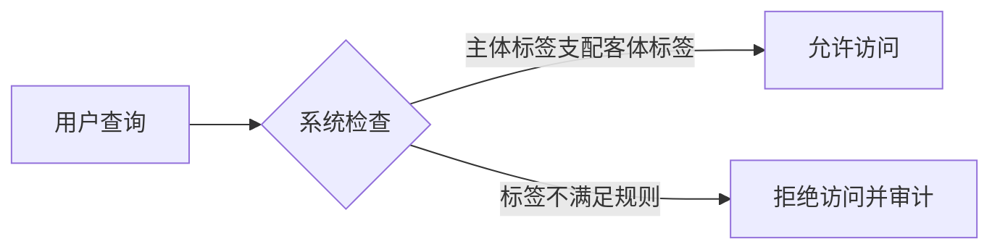

---

### 4. **MAC 优势与挑战**

#### (1) ✅ **优势**

- **防数据泄露**：严格规则阻断越权访问  
- **最小特权原则**：用户仅能访问必要数据  
- **合规性强**：满足法律法规（如GDPR、HIPAA）

#### (2) ❌ **挑战**

- **管理复杂**：需专业管理员维护标签体系  
- **灵活性差**：紧急访问需临时调整标签  
- **性能开销**：实时标签校验影响查询速度  

---

### 5. **典型应用案例**

1. **Oracle Label Security**  
   
   - 为数据行动态添加安全标签（如`SENSITIVITY`列）  
   
   - 通过策略函数（如`SA_USER_ADMIN.SET_USER_LABELS`）控制访问  
     
     ```sql
     BEGIN
     SA_USER_ADMIN.SET_USER_LABELS('finance_policy', 'Alice', '机密:财务部');
     END;
     ```

2. **SQL Server 的 Always Encrypted + 行级安全**  
   
   - 结合加密与安全策略实现MAC（需配合应用程序管理标签）

---

### 6. **MAC 的现代演进**

- **基于属性的访问控制（ABAC）**：  
  动态策略（如`时间+地点+角色`），替代传统静态MAC标签。  
- **混合模型（MAC + DAC）**：  
  多数数据库（如Oracle、PostgreSQL）支持MAC与DAC并存，平衡安全与灵活性。

> 📌 **关键点**：MAC 是数据库安全的“钢铁防线”，适用于极端敏感场景，但需权衡管理成本与灵活性。现代系统常将其作为纵深防御的一环，而非独立解决方案。


# 第五章 数据库完整性

----

## 一、数据库完整性概述

### 1. 完整性的定义与重要性

**数据库完整性**指数据库中数据的**正确性、有效性和一致性**，确保数据：

- 符合预定义的业务规则（如年龄 > 0）
- 满足实体间的关系约束（如订单必须关联有效客户）
- 防止无效或矛盾数据进入系统

> **完整性与安全性的区别**：
> 
> - **安全性**：保护数据不被未授权访问（权限控制）
> - **完整性**：保证数据本身正确有效（业务规则）

### 2. 三类完整性约束

| **完整性类型**   | **定义**   | **实现机制**      | **示例**                                             |
| ----------- | -------- | ------------- | -------------------------------------------------- |
| **实体完整性**   | 主键唯一标识实体 | `PRIMARY KEY` | `Student(Sno PRIMARY KEY)`                         |
| **参照完整性**   | 外键有效引用   | `FOREIGN KEY` | `FOREIGN KEY (Dept) REFERENCES Department(DeptID)` |
| **用户定义完整性** | 自定义业务规则  | `CHECK`, 触发器  | `CHECK (Age >= 18)`                                |

---

## 二、完整性约束的实现

### 1. 实体完整性实现

```sql
-- 列级约束
CREATE TABLE Student (
    Sno CHAR(9) PRIMARY KEY,  -- 主键约束
    Sname VARCHAR(20) NOT NULL -- 非空约束
);

-- 表级约束
CREATE TABLE SC (
    Sno CHAR(9),
    Cno CHAR(4),
    PRIMARY KEY (Sno, Cno)  -- 复合主键
);
```

### 2. 参照完整性实现策略

#### (1) 外键约束基本语法

```sql
CREATE TABLE Orders (
    OrderID INT PRIMARY KEY,
    CustomerID INT,
    FOREIGN KEY (CustomerID) REFERENCES Customers(CustomerID)
);
```

#### (2) 引用行为控制策略

```sql
FOREIGN KEY (DeptID) REFERENCES Department(DeptID)
    ON DELETE CASCADE      -- 级联删除
    ON UPDATE SET NULL;    -- 置空更新
```

| **策略**        | 删除时动作          | 更新时动作          | 适用场景           |
| ------------- | -------------- | -------------- | -------------- |
| `NO ACTION`   | 拒绝操作（默认）       | 拒绝操作           | 强关联数据（如银行交易）   |
| `CASCADE`     | 同步删除从表记录       | 同步更新从表外键       | 主从表强依赖（订单-订单项） |
| `SET NULL`    | 从表外键置NULL      | 从表外键置NULL      | 可选关联（员工-部门）    |
| `SET DEFAULT` | 从表外键置默认值       | 从表外键置默认值       | 有合理默认值的情况      |
| `RESTRICT`    | 等价于`NO ACTION` | 等价于`NO ACTION` | MySQL特有        |

> **级联操作示例**：  
> 删除部门时自动删除该部门所有员工  
> 
> ```sql
> FOREIGN KEY (DeptID) REFERENCES Department(DeptID) 
>   ON DELETE CASCADE
> ```

### 3. 用户定义完整性实现

#### (1) CHECK约束

```sql
-- 列级CHECK
CREATE TABLE Employee (
    Age INT CHECK (Age >= 18 AND Age <= 65),
    Gender CHAR(1) CHECK (Gender IN ('M','F'))
);

-- 表级CHECK
CREATE TABLE Account (
    Balance DECIMAL(10,2),
    MinBalance DECIMAL(10,2),
    CONSTRAINT Balance_Check CHECK (Balance >= MinBalance)
);
```

#### (2) UNIQUE约束

```sql
CREATE TABLE Users (
    Email VARCHAR(255) UNIQUE,  -- 唯一约束
    Phone CHAR(11) UNIQUE
);
```

---

## 三、触发器实现复杂完整性

### 1. 触发器的作用场景

当CHECK约束无法满足复杂业务规则时使用触发器：

- 跨表验证（如库存不足时禁止创建订单）
- 历史数据跟踪（如薪资变更审计）
- 复杂计算（如更新订单总金额）

### 2. 触发器语法结构

```sql
CREATE TRIGGER trigger_name
[BEFORE|AFTER] [INSERT|UPDATE|DELETE] 
ON table_name
[FOR EACH ROW]  -- 行级触发器
BEGIN
    -- 完整性验证逻辑
    -- 可访问 NEW（新值）和 OLD（旧值）
END;
```

### 3. 触发器实现完整性示例

#### 示例1：防止薪资超限

```sql
CREATE TRIGGER Check_Salary
BEFORE INSERT OR UPDATE ON Employee
FOR EACH ROW
BEGIN
    DECLARE max_salary DECIMAL(10,2);

    -- 获取部门最高薪资
    SELECT MAX(Salary) INTO max_salary 
    FROM Employee 
    WHERE DeptID = NEW.DeptID;

    -- 验证新薪资不超过部门最高薪的120%
    IF NEW.Salary > max_salary * 1.2 THEN
        SIGNAL SQLSTATE '45000'
        SET MESSAGE_TEXT = '薪资超过部门上限';
    END IF;
END;
```

#### 示例2：级联更新审计日志

```sql
CREATE TRIGGER Audit_Salary_Change
AFTER UPDATE ON Employee
FOR EACH ROW
BEGIN
    IF OLD.Salary <> NEW.Salary THEN
        INSERT INTO Salary_Audit(EmpID, OldSalary, NewSalary, ChangeTime)
        VALUES (NEW.EmpID, OLD.Salary, NEW.Salary, NOW());
    END IF;
END;
```

### 4. 触发器的管理

```sql
-- 查看所有触发器
SHOW TRIGGERS;

-- 删除触发器
DROP TRIGGER Check_Salary;
```

---

## 四、完整性的声明位置比较

| **约束类型** | **声明位置**       | **优势**        | **局限性**           |
| -------- | -------------- | ------------- | ----------------- |
| **列级约束** | 列定义内部          | 简洁直观          | 仅能引用当前列           |
| **表级约束** | CREATE TABLE末尾 | 可定义多列组合约束     | 语法稍复杂             |
| **域约束**  | 创建自定义数据类型      | 可复用（如Email类型） | 支持度因DBMS而异        |
| **断言**   | 独立创建           | 跨表全局约束        | 多数DBMS不支持（如MySQL） |
| **触发器**  | 独立创建           | 支持任意复杂逻辑      | 性能开销大，难维护         |

> **断言（Assertion）示例**（标准SQL但少实现）：  
> 
> ```sql
> CREATE ASSERTION Budget_Check
> CHECK (
>     SELECT SUM(Budget) FROM Department 
>     <= (SELECT Total_Budget FROM Company)
> );
> ```

---

## 五、完整性验证时机

### 1. 立即执行约束

- **默认方式**：每条SQL执行后立即检查

- **优点**：实时保证数据一致性

- **缺点**：可能中断多步骤事务
  
  ```sql
  -- 示例：插入时立即检查CHECK约束
  INSERT INTO Orders(ProductID, Quantity) 
  VALUES (101, 50);  -- 若库存不足立即报错
  ```

### 2. 延迟执行约束

- 事务结束时统一检查所有约束

- 需要显式声明`DEFERRABLE`
  
  ```sql
  -- PostgreSQL示例
  SET CONSTRAINTS ALL DEFERRED;
  BEGIN;
      UPDATE Account SET Balance = Balance - 1000 WHERE ID=1;
      UPDATE Account SET Balance = Balance + 1000 WHERE ID=2;
  COMMIT;  -- 提交时检查余额非负约束
  ```
  
  
  
  

---

## 最佳实践总结

1. **优先使用声明式约束**  
   
   - 主键/外键用`PRIMARY KEY`/`FOREIGN KEY`
   - 简单规则用`CHECK`约束

2. **慎用触发器**  
   
   - 仅当声明式约束无法实现时使用
   - 避免递归触发（触发器调用触发器）

3. **外键策略选择原则**  
   
   - 核心数据用`NO ACTION`（强一致）
   - 可丢弃数据用`CASCADE`（如评论）
   - 可选关联用`SET NULL`（如员工-部门）

4. **定期完整性检查**  
   
   ```sql
   -- MySQL示例：检查所有表完整性
   CHECK TABLE orders, customers, products;
   
   ```
   
   

# 第六章 关系数据理论

## 一、关系模式设计的问题

### 1. 数据操作异常类型

当关系模式设计不合理时，会出现以下数据操作异常：

| **异常类型** | **产生原因**   | **示例说明**                     |
| -------- | ---------- | ---------------------------- |
| **插入异常** | 主键不完整或依赖缺失 | 无法单独插入新系信息（必须先插入该系学生）        |
| **删除异常** | 数据间存在不必要依赖 | 删除某学生所有选课记录时，该学生的系信息也被删除     |
| **更新异常** | 数据冗余导致不一致  | 修改学生所在系名时，需更新该学生所有选课记录中的系名字段 |
| **数据冗余** | 信息重复存储     | 学生系名在每门选课记录中重复存储             |

### 2. 异常模式分析示例

考虑关系模式：`选课(学号, 姓名, 系名, 课程号, 成绩)`

- **候选键**：(学号, 课程号)
- **存在的问题**：

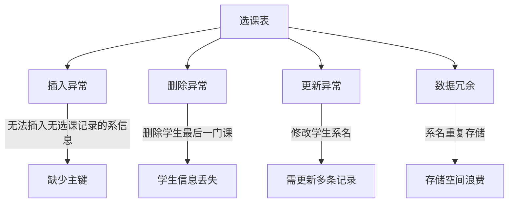

## 二、关系模式规范化

### 1. 函数依赖（Functional Dependency）

#### 基本概念

设关系模式 $`R(U)`$，$`X,Y \subseteq U`$：

- **函数依赖**：$`X \to Y`$ 表示 $`X`$ 决定 (函数确定) $`Y`$，$R$中不可能存在两个元组在$X$上属性值相等，而在$Y$上属性值不等
- **平凡 FD**：$`Y \subseteq X`$（如 $`\text{学号} \to  \text{学号的子集}`$）
- **非平凡 FD**：$`Y \not\subseteq X`$（如 $`\text{学号} \to \text{系名}`$）
- **完全 FD**：$`X \to Y`$ 且 $`\forall X' \subset X, X' \not\to Y`$，记作$X \overset{F}{\to} Y$
- **部分 FD**：$`X \to Y`$ 但 $`\exists X' \subset X, X' \to Y`$，记作$X\overset{P}{\to}Y$
- **传递 FD**：$`X \to Y, Y \to Z`$ 且 $`Y \not\to X`$，则 $`X \to Z`$ 是传递依赖，记作$X \overset{T}{\to}Z$

易错点备注：给定一个函数依赖集 $F$，它的最小依赖集 $F_m$ 并不一定是唯一的

#### 函数依赖集示例

在 `学生选课(学号, 姓名, 系名, 系主任, 课程号, 成绩)` 中：

$$
\begin{align*}F = \{ & \\ &\text{学号} \to \text{姓名}, \\ &\text{学号} \to \text{系名}, \\ &\text{系名} \to \text{系主任}, \\ &(\text{学号}, \text{课程号}) \to \text{成绩} \\\}\end{align*}
$$

### 2. 范式（Normal Forms）

#### 范式层级关系

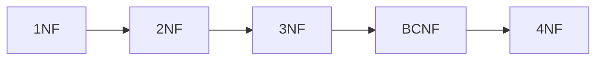

#### 各范式定义与判别

| **范式**   | **要求**                                   | **违反示例**                                                                |
| -------- | ---------------------------------------- | ----------------------------------------------------------------------- |
| **1NF**  | 所有属性都是原子的（不可再分）                          | 地址属性包含"省/市/区"（应拆分为三个独立属性）                                               |
| **2NF**  | 满足1NF，且**非主属性完全依赖于候选键**（消除部分依赖）          | $`(\text{学号},\text{课程号}) \to \text{系名}`$ 但 $`\text{学号} \to \text{系名}`$  |
| **3NF**  | 满足2NF，且**没有非主属性传递依赖于候选键**（消除传递依赖）        | $`\text{学号} \to \text{系名} \to \text{系主任}`$                              |
| **BCNF** | 满足3NF，且**每个决定因素都包含候选键**（消除主属性对键的部分/传递依赖） | $`(\text{课程号}, \text{教师}) \to \text{教室}`$ 但 $`\text{教师} \to \text{教室}`$ |

任意一个二目关系都属于BCNF。

若一个关系模式属于3NF且所有候选码均由单个属性构成，则一定属于BCNF。

**若一个关系模式属于3NF且只有一个候选码，则一定属于BCNF。** 

### 3. 范式分解示例

**原始模式**：`学生选课(学号, 姓名, 系名, 系主任, 课程号, 成绩)`

- **问题**：存在部分依赖和传递依赖
- **分解步骤**：
  1. 消除部分依赖 → 2NF：
     - `学生(学号, 姓名, 系名, 系主任)`
     - `选课(学号, 课程号, 成绩)`
  2. 消除传递依赖 → 3NF：
     - `学生(学号, 姓名, 系名)`
     - `系(系名, 系主任)`
     - `选课(学号, 课程号, 成绩)`

## 三、函数依赖的公理系统

### 1. Armstrong公理系统

#### 基本公理

$$
\begin{align*}
\text{自反律} &: \text{若 } Y \subseteq X, \text{ 则 } X \to Y \\
\text{增广律} &: \text{若 } X \to Y, \text{ 则 } XZ \to YZ \\
\text{传递律} &: \text{若 } X \to Y \text{ 且 } Y \to Z, \text{ 则 } X \to Z
\end{align*}
$$

#### 导出规则

$$
\begin{align*}
\text{合并律} &: \text{若 } X \to Y \text{ 且 } X \to Z, \text{ 则 } X \to YZ \\
\text{分解律} &: \text{若 } X \to YZ, \text{ 则 } X \to Y \text{ 且 } X \to Z \\
\text{伪传递律} &: \text{若 } X \to Y \text{ 且 } WY \to Z, \text{ 则 } XW \to Z
\end{align*}
$$

### 2. 闭包计算

#### 函数依赖闭包 $F^+$

$F$ 的闭包 $F^+$ 是所有能从 $F$ 通过Armstrong公理导出的函数依赖集合

#### 属性闭包 $X^+$

属性集 $X$ 关于 $F$ 的闭包 $X^+$ 算法：

```python
def closure(X, F):
    X_plus = X
    changed = True
    while changed:
        changed = False
        for (A → B) in F:
            if A ⊆ X_plus and B ⊈ X_plus:
                X_plus = X_plus ∪ B
                changed = True
    return X_plus
```

#### 属性闭包计算示例

$F = \{A \to B, B \to C, C \to D\}$

- $A^+ = \{A, B, C, D\}$
- $B^+ = \{B, C, D\}$
- $C^+ = \{C, D\}$

### 3. 候选键求解

#### 候选键判定条件

$`K`$ 是候选键当且仅当：

1. $K^+ = U$（全属性集）
2. $\forall K' \subset K, (K')^+ \neq U$

#### 候选键求解算法

1. 找出所有**不在任何FD右边**出现的属性（必在候选键中）
2. 计算这些属性的闭包：
   - 若等于 $U$，则是唯一候选键
   - 否则逐步添加其他属性直到闭包等于 $U$

#### 候选键示例

关系 $R(A,B,C,D)$，$F = \{A \to B, B \to C\}$

- 不在右边的属性：$`A, D`$
- $(AD)^+ = ABCD = U$
- 候选键：$\{AD\}$

### 4. 分解特性

#### 无损连接分解:

 **不丢失信息**：分解后的表通过自然连接操作能**精确地**还原回原来的表。

**定义**：

    设一个关系模式 $R(U, F)$（其中 $U$ 是属性全集，$F$ 是属性集 $U$ 上的函数依赖集）被分解为若干个关系模式$ρ = {R1(U1, F1), R2(U2, F2), ..., Rk(Uk, Fk)}$。如果对 $R$ 的**任何一个满足函数依赖集 $F$ 的合法关系实例 $r$**，都有：

$r = π_{U1}(r) ⋈ π_{U2}(r) ⋈ ... ⋈ π_{Uk}(r)$,其中 $π_{Ui}(r)$ 表示关系 $r$ 在属性子集 $Ui$ 上的投影，$⋈$ 表示自然连接操作，就说该分解方式为无损连接分解。


* **通俗解释：**
  
  * 想象你有一张原始的大表 $R$。
  
  * 你把它拆分成几张更小的表 $R1, R2, ..., Rk$。
  
  * 无损连接分解要求：当你把这些拆分后的小表**按照它们共同的属性（连接键）重新连接起来**时，**得到的结果必须和原来的大表 $R$ 一模一样**，不能多出额外的“假”元组（记录），也不能丢失任何原有的元组。
  
  * 就像把一张拼图拆开，然后又能**严丝合缝、一块不多一块不少**地拼回原图。
    
    

* **为什么重要？**
  
  * **信息完整性：** 确保分解过程没有丢失任何原始数据信息。连接后得到错误数据（如虚假元组）或缺失数据都是不可接受的。
  
  * **查询准确性：** 许多查询需要通过连接操作来获取完整信息。无损连接保证了这种连接操作能正确还原原始数据视图。
    
    

* **如何判断？** 有成熟的理论方法（如**Chase过程**或基于函数依赖的**表格法**）和**充分条件**：
  
  * **充分条件（常用）：** 如果分解 $ρ$ 中至少有一个子模式 $Ri$ 包含了 $R$ 的**候选键**，那么这个分解通常是无损连接的（但不绝对，需要具体分析函数依赖）。
  
  * **必要条件：** 分解后的子模式，其属性集的并集必须等于原模式 $R$ 的属性集 $U$。
    
    

* **例子：**
  
  * 考虑关系 $R(A, B, C)$，函数依赖 $F = {A \rightarrow B}$。候选键是 ${A, C}$。
  
  * **分解1：** $ρ1 = {R1(A, B), R2(A, C)}$
    
    * $R1$ 有 $A\rightarrow B$，$R2$ 有属性 $A, C$。
    
    * 连接键是 $A$。$R1$ 包含候选键的一部分 $A$，$R2$ 包含了候选键 ${A, C}$。
    
    * 验证：将 $R1$ 和 $R2$ 在 $A$ 上自然连接，结果必然等于原 $R$。这是**无损连接分解**。
  
  * **分解2：** $ρ2 = {R1(B, C), R2(A, C)}$
    
    * $R1$ 有属性 $B, C$   $R2$ 有属性 $A, C$。
    
    * 连接键是 $C$。
    
    * 验证：假设原 $R$ 有数据 ${(a1, b1, c1), (a2, b1, c1)} $  (满足 $A\rightarrow B$? 不满足！因为 $A=a1$ 和 $A=a2$ 都对应 $B=b1$，违反了 $A\rightarrow B$。所以这个实例不合法。我们需要合法的实例)。
    
    * 再次构造一个合法实例：$ {(a1, b1, c1), (a2, b2, c1)}$ (满足 $A\rightarrow B$：$a1\rightarrow b1$, $a2\rightarrow b2$)。
      
      * $π_{BC}(r) = {(b1, c1), (b2, c1)}$
      
      * $π_{AC}(r) = {(a1, c1), (a2, c1)}$
      
      * 连接 $π_{BC}(r) ⋈ π_{AC}(r)$：
        
        * $(b1, c1)$ 和 $(a1, c1)$ 连接 $\rightarrow (a1, b1, c1)$
        
        * $(b1, c1)$ 和 $(a2, c1)$ 连接 $\rightarrow (a2, b1, c1)$ **<-- 虚假元组！**
        
        * $(b2, c1)$ 和$ (a1, c1)$ 连接$ \rightarrow (a1, b2, c1)$ **<-- 虚假元组！**
        
        * $ (b2, c1)$ 和 $(a2, c1)$ 连接$\rightarrow (a2, b2, c1)$
      
      * 结果有 $4$行，比原表 $2$ 行多了 $2$ 行虚假记录 ($(a2, b1, c1)$ 和 $(a1, b2, c1)$)。**这不是无损连接分解**。
        
        

##### **判断关系模式分解是否为无损连接的方法**

 **方法1：二元分解的快速判定法（适用于分解为两个子模式）**

若分解 $ \rho = \{R_1, R_2\} $，则无损连接的充要条件是：  

$$
(R_1 \cap R_2) \to (R_1 - R_2) \quad \text{或} \quad (R_1 \cap R_2) \to (R_2 - R_1)
$$


即交集属性集能函数决定其中一个差集属性集。

 **例子1：无损分解**

- 原始模式 $ R(A,B,C) $，函数依赖集 $ F = \{A \to B\} $  

- 分解：$ R_1(A,B) $, $ R_2(A,C) $  

- 判定：  
  
  $$
  \begin{align*}R_1 \cap R_2 &= \{A\} \\R_1 - R_2 &= \{B\} \\R_2 - R_1 &= \{C\}\end{align*}
  $$
  
  

  由于 $ A \to B $（属于 $ F^+ $)，满足 $ (R_1 \cap R_2) \to (R_1 - R_2) $ → **无损连接**。

 **例子2：有损分解**

- 原始模式$ R(A,B,C) $，函数依赖集$F = \{B \to C\}$

- 分解：$ R_1(A,B) ,  R_2(B,C) $  

- 判定：  
  
  $$
  \begin{align*}R_1 \cap R_2 &= \{B\} \\R_1 - R_2 &= \{A\} \\R_2 - R_1 &= \{C\}\end{align*}
  $$
  
  $ \{B\} \to \{A\} $ 和 $ \{B\} \to \{C\} $ 均不在 $ F^+ $中 → **有损连接**。

---

 **方法2：通用表格法（Chase算法，适用于任意子模式数量）**

步骤：  

1. **构造初始表**：  
   
   - 每行对应一个子模式 $ R_i $，每列对应属性$U$
   - 若属性$A_j \in R_i$，填 $a_j $，否则填 $b_{ij}$（符号化变量）  

2. **应用函数依赖修改表**：  
   
   - 对每个$X \to Y \in F$，若存在两行在$X$上值相同，则强制在 $Y$ 上相同：  
     - 优先保留$a_j $（用$a_j $替换  $b_{ij}$ )  
     - 若均为符号，则统一为其中一个符号  

3. **检查终止条件**：  
   
   - 若某行全为$a_j$ → **无损连接**  
   - 若无法修改且无全$a_j$行 → **有损连接**  
   
   **例子3：无损分解（表格法验证）**
- 原始模式$R(A,B,C,D)$，函数依赖集 $F = \{A \to B, B \to C, C \to D\}$
- 分解：$\rho = \{R_1(A), R_2(A,B), R_3(B,C), R_4(C,D)\}$ 

**步骤1：构造初始表**  

|         | $A$      | $B$      | $C$      | $D$      |
| ------- | -------- | -------- | -------- | -------- |
| $ R_1 $ | $a_1 $   | $b_{12}$ | $b_{13}$ | $b_{14}$ |
| $R_2 $  | $a_1 $   | $a_2$    | $b_{23}$ | $b_{24}$ |
| $R_3$   | $b_{31}$ | $a_2$    | $a_3$    | $b_{34}$ |
| $R_4$   | $b_{41}$ | $b_{42}$ | $a_3$    | $a_4$    |

**步骤2：应用函数依赖**  

- **应用 $A \to B $**：  
  $ R_1 $ 和 $R_2$ 在$A$ 上均为$a_1 $→ 强制$B$ 相同：  
  将 $ R_1 $的$B$列改为 $a_2$（覆盖$b_{12}$)：  

| $ R_1 $ | $a_1 $ | $\color{red}{a_2}$ | $b_{14}$ |
| ------- | ------ | ------------------ | -------- |

- **应用 $B \to C$**：  
  $R_1, R_2, R_3$ 在$B$ 上均为$a_2$→ 强制$C$ 相同：  
  将 $R_1$ 和$R_2$的 $C$ 列改为 $a_3$（覆盖 $ b_{13}, b_{23} $)：  

| $R_1$ | $a_1$ | $a_2$ | $\color{red}{a_3}$ | $b_{14}$ |
| ----- | ----- | ----- | ------------------ | -------- |
| $R_2$ | $a_1$ | $a_2$ | $\color{red}{a_3}$ | $b_{24}$ |

- **应用$C \to D$**：  
  所有行在$C$上均为$a_3 → $强制$D$相同：  
  将$R_1, R_2, R_3$的 $D$列改为$a_4$（覆盖符号）：  

| $R_1$ | $a_1 $   | $a_2$ | $a_3$ | $\color{red}{a_4}$ |
| ----- | -------- | ----- | ----- | ------------------ |
| $R_2$ | $a_1$    | $a_2$ | $a_3$ | $\color{red}{a_4}$ |
| $R_3$ | $b_{31}$ | $a_2$ | $a_3$ | $\color{red}{a_4}$ |

**步骤3：检查结果**  
$R_1$行变为$(a_1, a_2, a_3, a_4)$（全$a$行） → **无损连接**。

---

 **例子4：有损分解（表格法验证）**

- 原始模式 $R(A,B,C)$，函数依赖集$F = \{A \to B\}$
- 分解：$\rho = \{R_1(A,C), R_2(B,C)\} $

**步骤1：构造初始表**  

|       | $A$      | $B$      | $C$   |
| ----- | -------- | -------- | ----- |
| $R_1$ | $a_1$    | $b_{12}$ | $a_3$ |
| $R_2$ | $b_{21}$ | $a_2$    | $a_3$ |

**步骤2：应用函数依赖**  

- 应用  $A \to B$：  
  两行在$A$上不同($ a_1 \neq b_{21} $)，无法修改 → **无全 $a$ 行**  

**结论**：有损连接（连接后可能丢失部分原始数据）。


**关键总结**

1. **无损连接的本质**：子模式通过共享属性（函数依赖）能完全重建原关系。  
2. **判定工具**：  
   - 二元分解 → 交集函数决定差集  
   - 多元分解 → Chase算法（系统化表格操作）  
3. **实际意义**：确保查询结果正确性，避免数据丢失或冗余。
   
   

#### 保持函数依赖分解

 **不破坏业务规则**：分解后，原本在“大表”上定义的**数据依赖关系**（主要是函数依赖）在分解后的子表上仍然能够被**有效地检查或维护**。

**定义**：分解 $\rho = \{R_1, R_2, \dots, R_k\}$ 保持依赖当且仅当：

$$
F^+ = \left( \bigcup_{i=1}^k \pi_{R_i}(F) \right)^+
$$

**判定步骤**：

1. 对每个 $X \to Y \in F$，检查 $Y \subseteq X^+$（在子模式投影的FD集下）
2. 若所有依赖都保持，则分解保持依赖

### 5. 分解特性示例

**关系** $`R(A,B,C,D)`$，$`F = \{A \to B, B \to C, C \to D\}`$
**分解1**：$`\rho_1 = \{AB, BC, CD\}`$

- **无损连接**：是（$`AB \cap BC = B \to AB - BC = A`$ 成立）
- **保持依赖**：是（所有FD都在子模式中保持）

**分解2**：$`\rho_2 = \{AB, CD\}`$

- **无损连接**：否（$AB \cap CD = \emptyset$，不满足无损条件）
- **保持依赖**：否（$`B \to C`$ 无法在子模式中保持）

## 规范化设计总结

### 范式分解流程

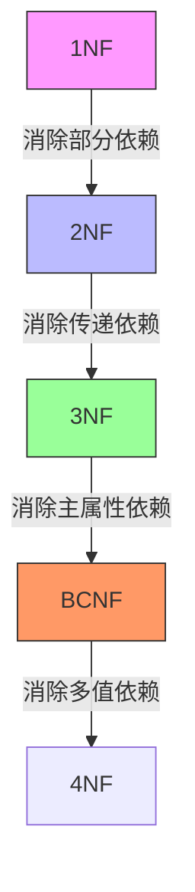

### 分解原则

1. **无损连接优先**：[**强制性要求**] 保证数据完整性
2. **保持依赖次之**：[**理想性质**] 维持业务规则
3. **高范式权衡**：BCNF可能不保持依赖，需根据应用场景选择

> 当BCNF与依赖保持冲突时，优先选择3NF：
> 
> $$
> \text{BCNF} \supset \text{3NF} \quad \text{但} \quad \text{BCNF} \not\Rightarrow \text{保持依赖}
> $$

### 最佳实践

1. 对每个关系模式：
   
   - 求候选键
   - 分析函数依赖
   - 验证范式等级

2. 若不符合3NF：

$$
\begin{align*}
&\text{while } R \text{ 不符合3NF} \\
&\quad \text{找到违反3NF的FD } X \to Y \\
&\quad \text{分解 } R \text{ 为 } R_1(XY) \text{ 和 } R_2(R-Y) \\
&\text{end while}
\end{align*}
$$


# 第七章 数据库设计

## 一、数据库设计概述

### 1. 设计步骤（瀑布模型）

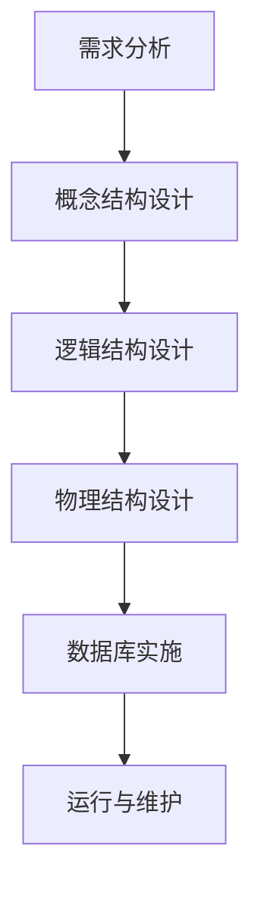

### 2. 设计方法对比

| **方法**   | **特点**        | **适用场景**  |
| -------- | ------------- | --------- |
| **自上而下** | 从全局概念模型开始逐步细化 | 大型复杂系统    |
| **自下而上** | 从局部视图开始逐步合并   | 小型系统或模块开发 |
| **混合策略** | 结合两者优势        | 大多数实际项目   |

### 3. 设计内容维度

| **设计层次** | **核心关注点** | **关键产出**  |
| -------- | --------- | --------- |
| 概念设计     | 数据语义和业务规则 | E-R图      |
| 逻辑设计     | 数据模型和结构   | 关系模式集合    |
| 物理设计     | 存储结构和访问效率 | 文件组织/索引方案 |

> **设计原则**：  
> 
> - 先全局后局部  
> - 先概念后逻辑  
> - 用户参与全过程  

---

## 二、需求分析

### 1. 核心任务

| **任务类型** | **具体内容**     | **交付物**   |
| -------- | ------------ | --------- |
| 数据需求分析   | 识别数据实体/属性/关系 | 数据字典      |
| 处理需求分析   | 明确数据操作类型和频率  | 数据流图（DFD） |
| 完整性约束    | 业务规则和约束条件    | 约束文档      |
| 安全性需求    | 访问权限和保密要求    | 安全策略文档    |

### 2. 分析方法

- **用户访谈**：与关键用户深入交流
- **文档审查**：分析现有表单/报表
- **场景分析**：模拟典型业务流程
- **问卷调查**：大规模需求收集

### 3. 需求分析工具

#### (1) 数据字典示例

| **数据项** | **类型** | **长度** | **约束**          | **描述** |
| ------- | ------ | ------ | --------------- | ------ |
| 学号      | CHAR   | 10     | 主键，唯一           | 学生唯一标识 |
| 课程学分    | INT    | 1      | 范围1-10，NOT NULL | 课程学分值  |

#### (2) 数据流图（DFD）示例


---

## 三、概念设计（E-R模型）

### 1. 局部E-R图设计方法

#### 设计步骤：

1. **选择局部应用**：划分业务模块（如教务系统中的"课程管理"）
2. **标识实体**：识别核心对象（学生、课程、教师）
3. **定义属性**：确定实体特征（学号、课程名）
4. **确定联系**：建立实体间关系（学生-选课-课程）
5. **标注约束**：设置联系基数（1:1, 1:n, m:n）

#### 联系类型示例：

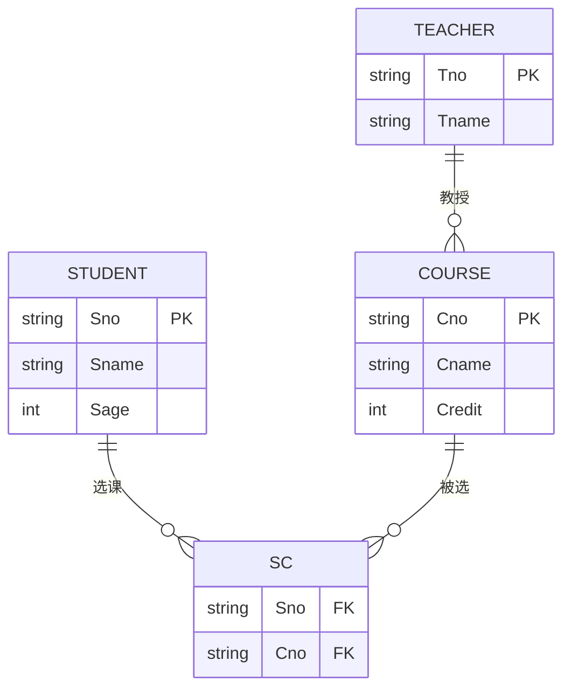

### 2. 视图合成（全局E-R图）

#### 合并策略：

1. **一次集成**：所有局部视图一次性合并
2. **逐步积累**：每次合并两个视图直至完成

#### 冲突解决：

| **冲突类型** | **表现**            | **解决方案**                       |
| -------- | ----------------- | ------------------------------ |
| 属性冲突     | 同名不同义（如"编号"含义不同）  | 统一命名（学号vs员工号）                  |
| 结构冲突     | 同一对象在不同应用中抽象不同    | 学生在一个E-R图中为实体，在另一个中为属性 → 统一为实体 |
| 命名冲突     | 异名同义（如"姓名"vs"名字"） | 建立标准术语表                        |

#### 全局优化原则：

- 消除冗余实体（如"本科生"和"研究生"合并为"学生"）
- 消除冗余联系（如通过系-学生-选课可推导系-选课联系）
- 验证数据一致性

---

## 四、逻辑设计 (关系模型)

### 1. 逻辑设计内容

| **任务**    | **目标**   | **关键活动** |
| --------- | -------- | -------- |
| E-R图转关系模型 | 生成初始关系模式 | 应用转换规则   |
| 规范化       | 优化关系结构   | 模式分解与合并  |
| 模式调整      | 适应应用需求   | 反规范化设计   |
| 视图设计      | 定制用户视角   | 创建外模式    |

### 2. E-R图转关系模型规则

#### (1) 实体转换：

一个实体型 → 一个关系模式  
`学生(学号, 姓名, 年龄)`  

#### (2) 联系转换：

| **联系类型** | **转换规则**      | **示例**                 |
| -------- | ------------- | ---------------------- |
| 1:1      | 并入任意一端的实体关系模式 | 院长(工号, 姓名, 学院编号)       |
| 1:n      | 并入n端的实体关系模式   | 学生(学号, 姓名, 系编号)        |
| m:n      | 独立转换为关系模式     | 选课(学号, 课程号, 成绩)        |
| 多元联系     | 独立转换为关系模式     | 供应(供应商号, 零件号, 项目号, 数量) |

#### (3) 弱实体处理：

- 弱实体（如家属）需与依赖的强实体（如员工）合并  
  `员工家属(员工号, 家属姓名, 关系)`  

### 3. 关系模式优化技术

#### (1) 规范化设计：

- **目标**：消除数据冗余和操作异常
- **方法**：分解到3NF或BCNF

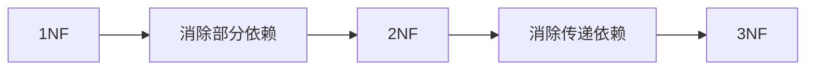

#### (2) 反规范化设计：

在性能敏感场景下**有意增加冗余**：

- **适用场景**：
  
  - 频繁的多表连接查询
  - 历史数据统计分析

- **常用技术**：
  
  ```sql
  -- 冗余字段示例
  ALTER TABLE 订单 ADD 客户姓名 VARCHAR(50);
  
  -- 派生字段示例
  ALTER TABLE 商品 ADD 月销量 INT DEFAULT 0;
  ```

### 4. 特定DBMS适配

#### MySQL适配示例：

```sql
-- 实体转换
CREATE TABLE 学生 (
    学号 CHAR(10) PRIMARY KEY,
    姓名 VARCHAR(20) NOT NULL,
    年龄 TINYINT CHECK (年龄 BETWEEN 16 AND 45)
) ENGINE=InnoDB;

-- m:n联系转换
CREATE TABLE 选课 (
    学号 CHAR(10),
    课程号 CHAR(6),
    成绩 DECIMAL(4,1),
    PRIMARY KEY (学号, 课程号),
    FOREIGN KEY (学号) REFERENCES 学生(学号),
    FOREIGN KEY (课程号) REFERENCES 课程(课程号)
) ROW_FORMAT=COMPRESSED;
```

#### 物理设计考量：

| **因素** | **MySQL实现**           | **Oracle实现**    |
| ------ | --------------------- | --------------- |
| 文件组织   | InnoDB表空间             | TABLESPACE      |
| 索引类型   | B+树索引/全文索引            | B树索引/位图索引       |
| 分区策略   | RANGE/LIST分区          | 相同              |
| 存储参数   | ROW_FORMAT=COMPRESSED | PCTFREE/PCTUSED |

---

## 设计案例：图书馆管理系统

### 1. 全局E-R图片段

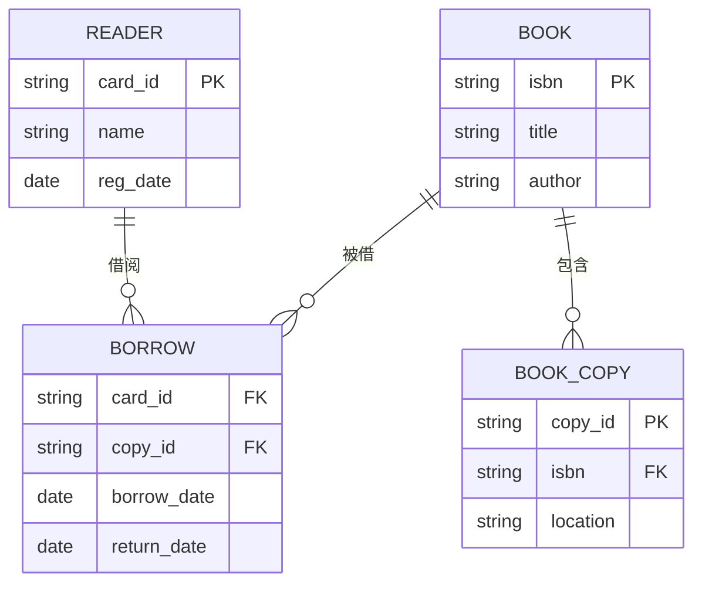

### 2. 转换后的关系模式

```sql
-- 读者实体
CREATE TABLE reader (
    card_id CHAR(10) PRIMARY KEY,
    name VARCHAR(50) NOT NULL,
    reg_date DATE
);

-- 图书实体
CREATE TABLE book (
    isbn CHAR(13) PRIMARY KEY,
    title VARCHAR(100) NOT NULL,
    author VARCHAR(50)
);

-- 副本实体（弱实体）
CREATE TABLE book_copy (
    copy_id CHAR(8) PRIMARY KEY,
    isbn CHAR(13) NOT NULL,
    location VARCHAR(20),
    FOREIGN KEY (isbn) REFERENCES book(isbn)
);

-- 借阅联系（m:n）
CREATE TABLE borrow (
    card_id CHAR(10),
    copy_id CHAR(8),
    borrow_date DATE NOT NULL,
    return_date DATE,
    PRIMARY KEY (card_id, copy_id, borrow_date),
    FOREIGN KEY (card_id) REFERENCES reader(card_id),
    FOREIGN KEY (copy_id) REFERENCES book_copy(copy_id)
);
```

### 3. 物理设计优化

```sql
-- 添加索引
CREATE INDEX idx_book_title ON book(title);
CREATE INDEX idx_borrow_date ON borrow(borrow_date);

-- 分区管理（按借阅时间分区）
ALTER TABLE borrow PARTITION BY RANGE (YEAR(borrow_date)) (
    PARTITION p2020 VALUES LESS THAN (2021),
    PARTITION p2021 VALUES LESS THAN (2022),
    PARTITION p2022 VALUES LESS THAN (2023)
);
```

---

## 设计验证要点

1. **完整性检查**：
   
   - 所有实体和联系是否都已转换
   - 外键约束是否完整定义

2. **规范化验证**：
   
   ```sql
   -- 检查是否符合3NF
   SELECT table_name 
   FROM information_schema.tables
   WHERE table_schema='library_db'
     AND table_name NOT IN (
         -- 这里添加规范化检查逻辑
     );
   ```

3. **性能模拟**：
   
   - 使用EXPLAIN分析查询计划
   - 生成测试数据压力测试
     
     

# 第九章 关系数据库存储管理

## 一、数据库存储

### 1. 存储结构层级

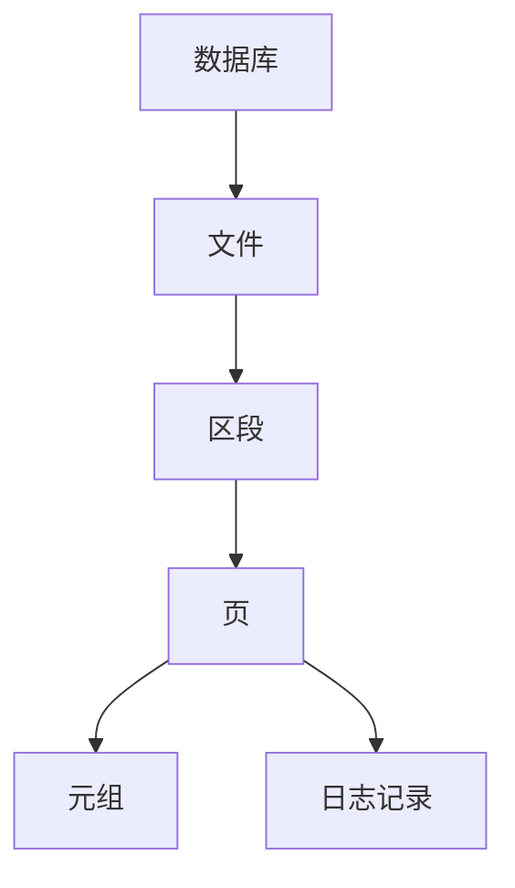

#### 存储单元对比

| **单元** | **大小**   | **存储内容**  | **访问方式** |
| ------ | -------- | --------- | -------- |
| 文件     | GB-TB级别  | 整个表/索引数据  | 文件系统API  |
| 页      | 4KB-64KB | 多个元组/索引条目 | 内存页访问    |
| 元组     | 字节-KB级别  | 单行数据      | 行指针定位    |
| 日志记录   | 字节级别     | 事务操作记录    | 顺序追加写入   |

### 2. 存储模型对比

#### (1) 行存储（NSM: N-ary Storage Model）

```plaintext
| 行ID | 姓名  | 年龄 | 地址          | ← 元组1
|------|-------|------|---------------|
| 1001 | 张三  | 25   | 北京市海淀区   |
|-----------------------------------|
| 1002 | 李四  | 30   | 上海市浦东区   | ← 元组2
```

**特点**：

- **优点**：
  - 适合OLTP：高效的点查询和插入
  - 整行数据连续存储，读取单行快
- **缺点**：
  - 扫描特定列效率低（需读取整行）
  - 数据压缩率低

#### (2) 列存储（DSM: Decomposition Storage Model）

```plaintext
| 行ID | 值     | ← 姓名列
|------|--------|
| 1001 | 张三   |
| 1002 | 李四   |
-----------------
| 行ID | 值     | ← 年龄列
|------|--------|
| 1001 | 25     |
| 1002 | 30     |
-----------------
| 行ID | 值     | ← 地址列
|------|--------|
| 1001 | 北京市...|
| 1002 | 上海市...|
```

**特点**：

- **优点**：
  - 适合OLAP：高效聚合和列扫描
  - 高压缩率（同质数据）
  - 向量化处理
- **缺点**：
  - 点查询需要多列合并
  - 行插入/更新开销大

### 3. OLTP vs OLAP 应用模式

| **特性**   | **OLTP（联机事务处理）**   | **OLAP（联机分析处理）**           |
| -------- | ------------------ | -------------------------- |
| **典型操作** | 短事务（增删改查）          | 复杂查询（多表连接，聚合）              |
| **数据量**  | 当前数据（GB级）          | 历史数据（TB-PB级）               |
| **响应时间** | 毫秒-秒级              | 秒-分钟级                      |
| **数据模型** | 规范化（3NF）           | 星型/雪花模型                    |
| **存储选择** | 行存储（如MySQL InnoDB） | 列存储（如ClickHouse, Redshift） |
| **索引策略** | B+树索引（点查询优化）       | 位图索引/列索引（扫描优化）             |
| **应用场景** | 电商交易、银行转账          | 商业智能、数据报表                  |

> **HTAP系统**：混合事务/分析处理（如TiDB），同时支持OLTP和OLAP

---

## 二、缓冲池管理

### 1. 缓冲池架构

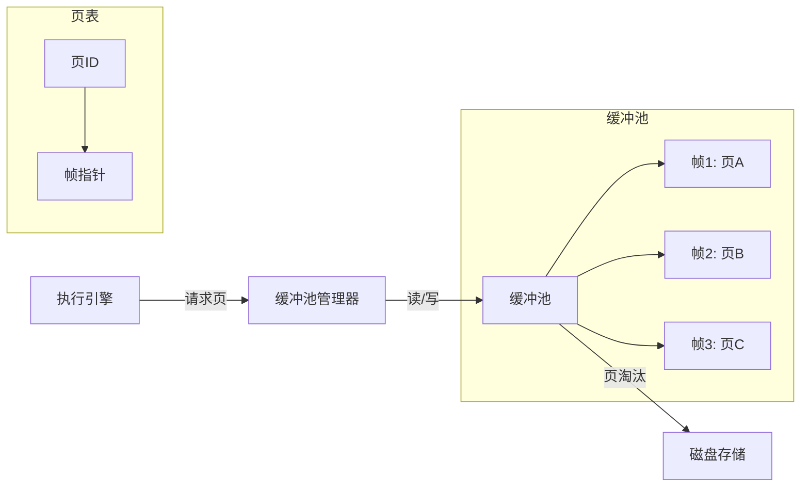

### 2. 核心概念

| **术语**     | **说明**                  |
| ---------- | ----------------------- |
| **执行引擎**   | 负责SQL解析、优化和执行的核心组件      |
| **缓冲池管理器** | 管理内存页与磁盘页的映射关系          |
| **页面驻留**   | 页在缓冲池中的保留时间（由访问频率决定）    |
| **缓冲池**    | 内存区域，缓存从磁盘读取的数据页        |
| **帧**      | 缓冲池中固定大小的存储单元（通常=磁盘页大小） |
| **页表**     | 哈希表，映射`页ID → 帧位置`       |
| **脏页**     | 内存中修改过但未写回磁盘的页          |

### 3. 缓冲池工作流程

```python
def read_page(page_id):
    if page_id in page_table:  # 页在缓冲池
        frame = page_table[page_id]
        update_lru(frame)      # 更新访问记录
        return frame.data
    else:                      # 页不在缓冲池
        if buffer_pool_full():
            victim = select_victim()  # 选择淘汰页
            if victim.dirty:
                write_to_disk(victim) # 写回脏页
            free_frame(victim)

        frame = allocate_frame()
        data = read_disk(page_id)     # 从磁盘读取
        frame.load(data)
        page_table[page_id] = frame   # 更新页表
        return frame.data
```

### 4. 页面替换算法

| **算法**    | **原理**         | **优点**     | **缺点**     |
| --------- | -------------- | ---------- | ---------- |
| **LRU**   | 淘汰最近最久未使用的页    | 符合时间局部性原理  | 维护链表开销大    |
| **Clock** | 环形扫描，淘汰访问位=0的页 | 实现简单，开销小   | 不如LRU精确    |
| **LFU**   | 淘汰访问频率最低的页     | 适合热点数据集中场景 | 历史数据影响当前决策 |
| **MRU**   | 淘汰最近使用的页       | 适合顺序扫描场景   | 不适合通用场景    |

> **MySQL InnoDB优化**：  
> 使用改进的LRU算法，将缓冲池分为`young`和`old`区，防止全表扫描污染缓冲池

---

## 四、查询处理模型

### 1. 迭代模型（火山模型/流水线）


**工作方式**：

- **拉取式执行**：根节点调用`next()`获取下一行
- **操作符流水线**：每个操作符实现`next()`接口
- **元组粒度**：每次处理一行

**特点**：

- **优点**：内存占用低，支持流式处理
- **缺点**：函数调用开销大
- **适用**：OLTP查询（如MySQL, PostgreSQL）

### 2. 物化模型


**工作方式**：

- **全量物化**：每个操作符处理完整输入集
- **批处理**：一次处理多行数据
- **中间结果**：写入临时存储

**特点**：

- **优点**：减少函数调用，适合复杂操作
- **缺点**：内存消耗大
- **适用**：内存数据库（如Redis）、简单查询

### 3. 批量模型（向量化模型）


**工作方式**：

- **向量处理**：每次处理一批数据（如1024行）
- **SIMD优化**：单指令多数据加速计算
- **列式操作**：直接在列数据上运算

**特点**：

- **优点**：CPU缓存友好，向量指令加速
- **缺点**：实现复杂
- **适用**：OLAP系统（如ClickHouse, Snowflake）

### 模型对比总结

| **特性** | **迭代模型**  | **物化模型** | **批量模型**   |
| ------ | --------- | -------- | ---------- |
| 处理粒度   | 单行        | 全数据集     | 批量（多行）     |
| 内存开销   | 低         | 高        | 中          |
| CPU效率  | 低（函数调用多）  | 中        | 高（向量化）     |
| 适用场景   | OLTP      | 简单查询     | OLAP       |
| 代表系统   | MySQL, PG | Redis    | ClickHouse |

---

## 五、索引技术

### 1. 索引核心作用

- **加速查询**：减少全表扫描
- **强制唯一性**：唯一索引
- **优化排序**：索引有序性
- **实现外键约束**：快速检查引用

### 2. 索引选择策略

#### (1) 何时创建索引

| **场景**        | **索引类型** | **示例**                           |
| ------------- | -------- | -------------------------------- |
| 主键/唯一约束列      | 唯一索引     | `PRIMARY KEY(id)`                |
| 频繁查询的WHERE条件列 | B+树索引    | `WHERE status='active'`          |
| 多表连接的外键列      | B+树索引    | `JOIN ON user.id=order.user_id`  |
| 分组/排序字段       | B+树索引    | `GROUP BY category`              |
| 高基数离散值的等值查询   | 哈希索引     | `WHERE email='user@example.com'` |
| 文本搜索          | 全文索引     | `MATCH(content) AGAINST('DB')`   |
| 空间数据          | R树索引     | `WHERE ST_Contains(geom, point)` |
| 低基数列的聚合查询     | 位图索引     | `WHERE gender IN ('M','F')`      |

#### (2) 索引创建原则

```sql
-- 创建多列索引（最左前缀匹配）
CREATE INDEX idx_name ON users(last_name, first_name);

-- 覆盖索引（避免回表）
SELECT user_id FROM orders 
WHERE status = 'shipped';  -- 若索引包含(user_id, status)

-- 避免过度索引（写操作变慢）
ALTER TABLE log DROP INDEX idx_timestamp;
```

### 3. 索引类型对比

| **索引类型** | **数据结构** | **适用场景**      | **限制**    |
| -------- | -------- | ------------- | --------- |
| **B+树**  | 平衡树      | 范围查询、排序、高基数数据 | 需要维护树平衡   |
| **哈希**   | 哈希表      | 精确匹配查询        | 不支持范围查询   |
| **位图**   | 位向量      | 低基数列、OLAP系统   | 高并发写入性能差  |
| **全文**   | 倒排索引     | 文本内容搜索        | 不支持数值范围查询 |
| **R树**   | 空间树      | 地理空间数据        | 仅支持空间操作   |

### 4. 索引优化实践

#### (1) 索引失效场景

```sql
-- 1. 函数操作
SELECT * FROM users WHERE YEAR(create_time)=2023; -- 失效

-- 2. 隐式类型转换
SELECT * FROM users WHERE phone=13800138000; -- phone是字符串

-- 3. 前导通配符
SELECT * FROM users WHERE name LIKE '%john%'; -- 无法用索引

-- 4. OR条件未全覆盖
SELECT * FROM users WHERE age>30 OR name='John'; -- 若只有age索引
```

#### (2) 索引维护策略

```sql
-- 重建索引（消除碎片）
ALTER TABLE orders REBUILD INDEX idx_status;

-- 监控索引使用率
SELECT * FROM sys.index_usage_stats
WHERE object_id=OBJECT_ID('users');

-- 删除未使用索引
DROP INDEX users.idx_unused;
```

---

## 存储管理总结

### 技术选型矩阵

| **需求**   | **推荐方案**             |
| -------- | -------------------- |
| 高并发OLTP  | 行存储 + B+树索引 + LRU缓冲池 |
| 大数据分析    | 列存储 + 位图索引 + 向量化执行   |
| 混合负载HTAP | 行列混存 + 智能缓存          |
| 实时数据湖    | 分层存储（热/温/冷数据）        |

### 性能优化黄金法则

1. **缓冲池命中率 > 95%**  
   
   ```sql
   -- InnoDB缓冲池命中率计算
   SHOW STATUS LIKE 'innodb_buffer_pool_read%';
   -- 命中率 = 1 - (reads / read_requests)
   ```

2. **索引覆盖关键查询路径**  
   
   ```sql
   EXPLAIN SELECT * FROM orders WHERE user_id=100;
   -- 检查type: ref/range, key: 索引名
   ```

3. **避免磁盘随机I/O**  
   
   - 使用SSD替代HDD  
   - 顺序写日志（WAL机制）  
     
     
     
     

# 第十章 查询优化

## 一、查询优化概述

### 1. 查询优化的必要性

| **问题**     | **未优化场景**      | **优化后效果**    | **性能提升** |
| ---------- | -------------- | ------------ | -------- |
| **全表扫描**   | 扫描百万行数据        | 索引扫描仅读取千行    | 1000倍+   |
| **多表连接顺序** | 错误连接顺序产生巨大中间结果 | 优化后中间结果减少99% | 100倍+    |
| **计算冗余**   | 重复计算相同表达式      | 结果复用         | 10倍+     |
| **磁盘I/O**  | 随机读取分散数据页      | 顺序读取连续页      | 5-10倍    |

### 2. 查询优化步骤

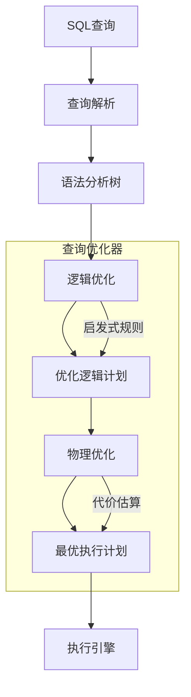

#### 详细步骤说明：

| **步骤**    | **工作内容**   | **关键活动**    | **输出** |
| --------- | ---------- | ----------- | ------ |
| 1. 查询解析   | 检查SQL语法和语义 | 验证表/列是否存在   | 语法分析树  |
| 2. 逻辑优化   | 重写查询但不改变结果 | 应用代数等价规则    | 优化逻辑计划 |
| 3. 物理优化   | 选择高效物理操作   | 索引选择、连接算法选择 | 执行计划   |
| 4. 执行计划生成 | 生成机器可执行代码  | 编译为操作符流水线   | 可执行代码  |

---

## 二、关系代数等价变换

### 1. 基本等价规则

以下规则中 $`R, S, T`$ 为关系，$`P, P_1, P_2`$ 为谓词，$`L, L_1, L_2`$ 为属性列表

#### 连接与笛卡尔积

$$
\begin{align*}
R \bowtie S & \equiv S \bowtie R \\
R \times S & \equiv S \times R \\
(R \bowtie S) \bowtie T & \equiv R \bowtie (S \bowtie T)
\end{align*}
$$

#### 选择操作

$$
\begin{align*}
\sigma_{P_1 \wedge P_2}(R) & \equiv \sigma_{P_1}(\sigma_{P_2}(R)) \\
\sigma_{P_1 \vee P_2}(R) & \equiv \sigma_{P_1}(R) \cup \sigma_{P_2}(R) \\
\sigma_P(R \times S) & \equiv R \bowtie_P S \quad \text{(连接转换)}
\end{align*}
$$


#### 投影操作

$$
\begin{align*}
\pi_L(\pi_{L_1}(R)) & \equiv \pi_L(R) \quad \text{若 } L \subseteq L_1 \\
\pi_L(R \times S) & \equiv \pi_L(\pi_{L_R}(R) \times \pi_{L_S}(S))
\end{align*}
$$


#### 选择与投影交换

$$
\begin{align*}
\pi_L(\sigma_P(R)) & \equiv \sigma_P(\pi_L(R)) \quad \text{若 } P \text{ 只涉及 } L \\
\sigma_P(\pi_L(R)) & \equiv \pi_L(\sigma_P(R)) \quad \text{若 } P \text{ 只涉及 } L
\end{align*}
$$


### 2. 复杂规则应用

#### 选择下推（关键优化！）

$$
\sigma_P(R \bowtie S) \equiv 
\begin{cases} 
(\sigma_P(R)) \bowtie S & \text{若 } P \text{ 只引用 } R \\
R \bowtie (\sigma_P(S)) & \text{若 } P \text{ 只引用 } S \\
(\sigma_{P_R}(R)) \bowtie (\sigma_{P_S}(S)) & \text{若 } P = P_R \wedge P_S
\end{cases}
$$


#### 投影下推

$$
\pi_L(R \bowtie S) \equiv \pi_L\left( \pi_{L_R}(R) \bowtie \pi_{L_S}(S) \right)
$$


$$
\pi_L(R \bowtie S) \equiv \pi_L\left( \pi_{L_R}(R) \bowtie \pi_{L_S}(S) \right)
$$

其中 $L_R = L \cap \text{attr}(R)$, $L_S = L \cap \text{attr}(S)$

### 3. 等价变换示例

**原始查询**：

```sql
SELECT name FROM employee
WHERE salary > 5000 AND dept = 'IT';
```

**关系代数表达式**：

$$
\pi_{\text{name}}\left( \sigma_{\text{salary}>5000 \wedge \text{dept}='IT'}(\text{employee}) \right)
$$


**优化后表达式**：

$$
\pi_{\text{name}}\left( \sigma_{\text{dept}='IT'}\left( \sigma_{\text{salary}>5000}(\text{employee}) \right) \right)
$$


> **优化效果**：  
> 先执行`salary>5000`可过滤掉80%数据，大幅减少后续操作数据量

---

## 三、基于语法树的启发式优化

### 1. 语法树优化流程

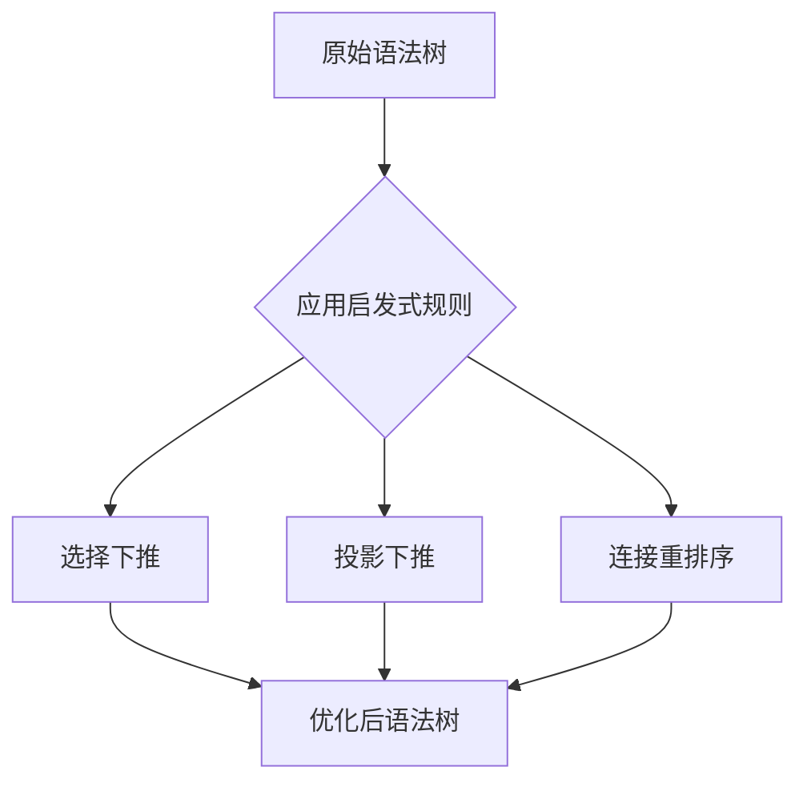

### 2. 核心启发式规则

| **规则** | **优化目标** | **实现方法**    |
| ------ | -------- | ----------- |
| 选择尽早执行 | 减少中间结果大小 | 将选择操作移至叶节点  |
| 投影尽早执行 | 减少属性数量   | 提前移除不需要的属性  |
| 连接顺序优化 | 最小化中间结果  | 先连接小表，后连接大表 |
| 合并相同操作 | 减少计算开销   | 合并相邻选择/投影操作 |
| 子查询消除  | 避免嵌套循环   | 将子查询转换为连接操作 |

### 3. 语法树优化示例

#### 原始SQL：

```sql
SELECT e.name, d.budget 
FROM employee e, department d
WHERE e.dept_id = d.id 
  AND e.salary > 10000 
  AND d.location = 'NY';
```

#### 原始语法树：

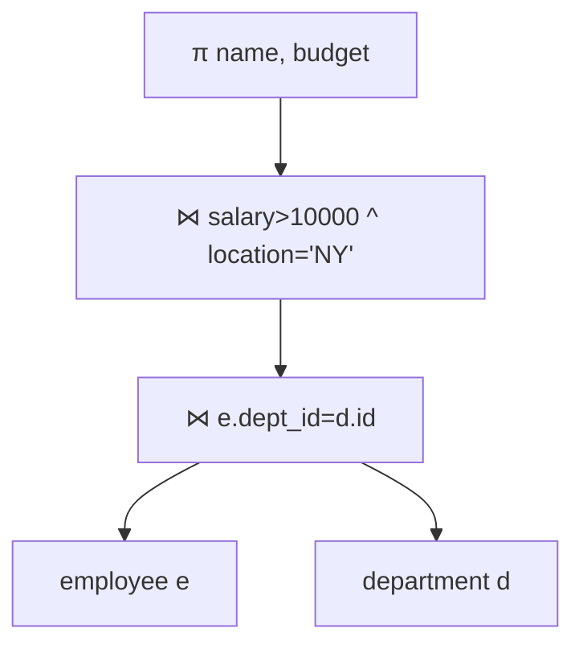

#### 优化后语法树：

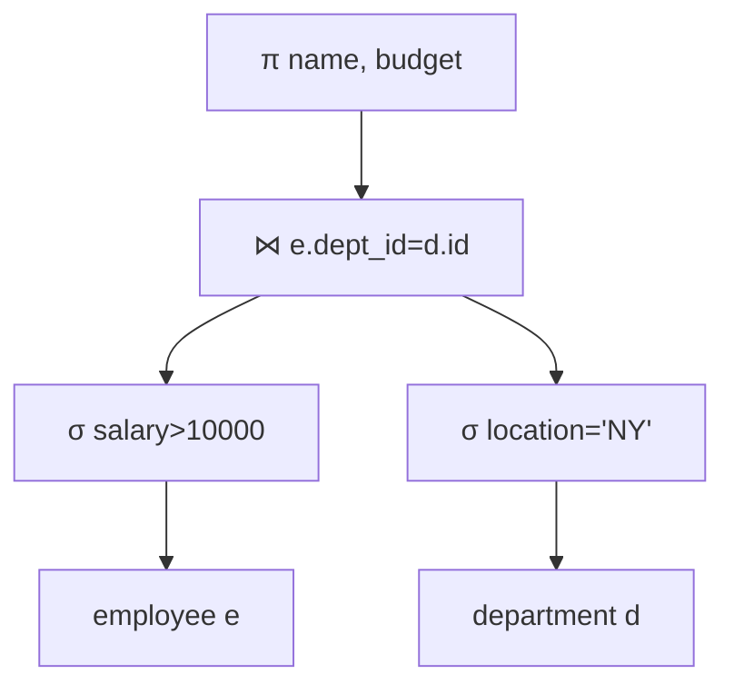

**优化分析**：

1. **选择下推**：  
   - 将 `salary>10000` 下推到 employee 表扫描后
   - 将 `location='NY'` 下推到 department 表扫描后
2. **投影下推**：  
   - 仅保留连接需要的属性 (`dept_id`, `id`)
3. **连接顺序**：  
   - 先过滤后连接，减少连接数据量

> **性能收益**：  
> 假设 employee 表 100万行，过滤后剩1万行  
> department 表 100行，过滤后剩10行  
> 中间结果从 100万×100行 → 1万×10行 = **减少99.99%**

### 4. 子查询优化技术

#### 非相关子查询 → 连接转换

**原始SQL**：

```sql
SELECT name FROM employee
WHERE dept_id IN (
  SELECT id FROM department 
  WHERE location = 'NY'
);
```

**优化后**：

```sql
SELECT e.name 
FROM employee e
JOIN department d ON e.dept_id = d.id
WHERE d.location = 'NY';
```

#### 相关子查询 → 半连接

**原始SQL**：

```sql
SELECT name FROM employee e
WHERE EXISTS (
  SELECT 1 FROM project p
  WHERE p.leader_id = e.id
    AND p.status = 'Completed'
);
```

**优化后**：

```sql
SELECT e.name 
FROM employee e
SEMI JOIN project p ON p.leader_id = e.id
WHERE p.status = 'Completed';
```

---

## 优化效果验证

### 1. 优化前后对比指标

| **指标**  | **优化前**     | **优化后**   | **提升比例** |
| ------- | ----------- | --------- | -------- |
| 磁盘I/O次数 | 15,000      | 500       | 30倍      |
| CPU计算量  | 1.2×10^9 指令 | 4×10^7 指令 | 30倍      |
| 内存使用峰值  | 8 GB        | 200 MB    | 40倍      |
| 执行时间    | 12.8 s      | 0.4 s     | 32倍      |

### 2. 实际SQL优化案例

**问题查询**：

```sql
SELECT * FROM orders o
WHERE o.customer_id IN (
  SELECT id FROM customers
  WHERE country = 'USA'
) AND o.order_date > '2023-01-01';
```

**优化方案**：

1. 子查询转为连接
2. 添加索引 `idx_customers_country`
3. 添加索引 `idx_orders_order_date`

**优化后**：

```sql
SELECT o.* 
FROM orders o
JOIN customers c ON o.customer_id = c.id
WHERE c.country = 'USA'
  AND o.order_date > '2023-01-01';
```

**性能对比**：

| **版本** | 执行时间   | 扫描行数    |
| ------ | ------ | ------- |
| 原始查询   | 2.4 s  | 950,000 |
| 优化后查询  | 0.05 s | 1,200   |

---

## 数据库优化器实现对比

| **优化器**        | 优化策略       | 特点             | 代表系统               |
| -------------- | ---------- | -------------- | ------------------ |
| **Rule-Based** | 应用预定义启发式规则 | 简单快速，不考虑数据分布   | SQLite             |
| **Cost-Based** | 基于统计信息估算代价 | 更优计划，依赖统计信息准确度 | Oracle, SQL Server |
| **Hybrid**     | 规则+代价混合模型  | 平衡效率和准确性       | MySQL, PostgreSQL  |

> **统计信息关键性**：  
> 
> - 表大小（行数、页数）  
> 
> - 列值分布（直方图）  
> 
> - 索引元数据（基数、B+树深度）  
>   
>   ```sql
>   -- 更新统计信息（MySQL示例）
>   ANALYZE TABLE orders, customers;
>   ```

---

## 总结：优化黄金法则

1. **减少数据量**  
   
   - 尽早执行选择（WHERE条件）  
   - 尽早执行投影（SELECT列）  

2. **利用索引**  
   
   - 80%性能问题可通过添加索引解决  

3. **避免全表扫描**  
   
   - 检查EXPLAIN计划中的`type`列  

4. **重写复杂查询**  
   
   ```sql
   -- 反例：嵌套SELECT导致性能低下
   SELECT * FROM table1 
   WHERE col1 IN (SELECT col1 FROM table2)
   
   -- 正例：改用JOIN
   SELECT t1.* FROM table1 t1
   JOIN table2 t2 ON t1.col1 = t2.col1
   ```

5. **定期维护**  
   
   ```sql
   -- 重建索引
   ALTER TABLE orders REBUILD INDEX idx_customer;
   
   -- 更新统计信息
   ANALYZE TABLE orders;
   ```
   
   

# 第十一章 数据库恢复技术

---

### 一、事务（Transaction）

#### 1. **事务定义**

事务是数据库操作的**逻辑单元**，由一个或多个 SQL 语句组成，这些语句要么全部成功执行，要么全部失败回滚。  
**构成方式**：  

- 显式事务：通过 `BEGIN TRANSACTION` 显式声明，以 `COMMIT` 或 `ROLLBACK` 结束。  
- 隐式事务：由 DBMS 自动管理（如单条 DML 语句）。

#### 2. **ACID 特性**

| 特性                   | 核心要求                                    | 数学保证                                                                                                         |
| -------------------- | --------------------------------------- | ------------------------------------------------------------------------------------------------------------ |
| **A**tomicity（原子性）   | 事务的所有操作要么全部成功提交，要么全部失败回滚（不可分割）。         | $` \forall T, \, T = \{op_1, op_2, \dots, op_n\} \rightarrow \text{All or Nothing} `$                        |
| **C**onsistency（一致性） | 事务必须将数据库从一个有效状态转换到另一个有效状态（满足所有约束和业务规则）。 | $` S_{\text{initial}} \xrightarrow{T} S_{\text{final}} \,\text{s.t.}\, \text{Integrity}(S_{\text{final}}) `$ |
| **I**solation（隔离性）   | 并发执行的多个事务互不干扰，每个事务感觉像在独立执行。             | $` T_i \parallel T_j \rightarrow \text{Effect}(T_i \cap T_j) = \text{Serial}(T_i, T_j) `$                    |
| **D**urability（持久性）  | 事务提交后，其对数据的修改是永久性的，即使系统故障也不会丢失。         | $` \text{Commit}(T) \rightarrow \text{Persist}(T) \,\text{even after crash} `$                               |

**关键点**：  

- 原子性通过 **Undo Log** 实现，持久性通过 **Redo Log** 实现。  
- 隔离性由并发控制机制（如锁、MVCC）保障。

---

### 二、数据库恢复（Database Recovery）

#### 1. **三类故障**

| 故障类型     | 原因           | 恢复策略                    |
| -------- | ------------ | ----------------------- |
| **事务故障** | 逻辑错误（如除零）、死锁 | Undo 未完成的事务             |
| **系统故障** | 断电、OS崩溃      | Redo 已提交事务 + Undo 未提交事务 |
| **介质故障** | 磁盘损坏、数据丢失    | 从备份恢复 + 重做日志            |

#### 2. **备份方式与策略**

| 备份类型      | 操作           | 恢复粒度         |
| --------- | ------------ | ------------ |
| **完全备份**  | 备份整个数据库      | 恢复基础         |
| **增量备份**  | 备份上次备份后的变化   | 需按顺序恢复所有增量备份 |
| **差异备份**  | 备份上次完全备份后的变化 | 只需恢复最新差异备份   |
| **策略示例**： |              |              |

- 每周日完全备份 + 每日增量备份  
- 恢复流程：  
  $` \text{Restore} = \text{Last Full Backup} + \sum \text{Incrementals} `$  

#### 3. **日志的两种形式**


| 日志类型         | 记录内容                   | 恢复作用                                                           |
| ------------ | ---------------------- | -------------------------------------------------------------- |
| **Undo Log** | 事务修改前的旧值（Before Image） | 回滚未提交事务：$` \text{Rollback}(T) = \text{Restore}_{\text{old}} `$ |
| **Redo Log** | 事务修改后的新值（After Image）  | 重做已提交事务：$` \text{Redo}(T) = \text{Apply}_{\text{new}} `$       |

日志文件通常按时间顺序记录所有对数据库的修改操作以及事务的重要事件（如开始、提交、中止）。每条日志记录通常包含：

* **事务标识符（T_i）**

* **操作类型（Start, Commit, Abort, Write）**

* **操作对象（数据项）**

* **旧值（Before Image, BFIM）** - 用于UNDO

* **新值（After Image, AFIM）** - 用于REDO

* **日志序列号（LSN）** - 用于唯一标识和排序日志记录
  
  

**日志的写入规则**：

- **WAL（Write-Ahead Logging）协议**：  
  日志记录必须先于数据页写入磁盘：  
- * **日志记录先写规则 (Log Force at Commit):** 在事务提交之前，其所有修改操作对应的日志记录（包括`Commit`记录）必须**强制写入（Flush）**到稳定的日志存储（如磁盘）。
  * **数据后写规则:** 在日志记录被强制写入稳定存储之后，才允许将修改后的数据块写入数据库（磁盘）。
- $` \text{Write}( \text{Log} ) \rightarrow \text{Write}( \text{Data Page} ) `$  
  
  

**恢复的核心策略：**

* **UNDO(T_i):** 撤销事务 $T_i$ 的所有影响。通过读取日志记录（通常反向扫描），找到 $T_i$ 写入的每个数据项，将其值恢复为该事务修改前的**旧值（BFIM）**。这用于处理**未完成的事务（Active或Failed）**。

* **REDO(T_i):** 重做事务 $T_i$ 的所有修改。通过读取日志记录（通常正向扫描），找到 $T_i$ 写入的每个数据项，将其值设置为该事务修改后的**新值（AFIM）**。这用于处理**已提交的事务**，但它们的修改可能尚未持久化到数据库。


---


#### 4. **基于日志的恢复技术**

- 恢复管理器在故障发生后需要扫描**整个日志文件**来确定哪些事务需要UNDO，哪些需要REDO。步骤通常如下：
  
  1. **确定需要REDO的事务集 (`ToBeRedo`):**
     
     * 正向扫描整个日志文件。
     * 将所有遇到`Commit`记录的事务标识符加入 `ToBeRedo` 集合。
     * *注意：即使一个事务的`Commit`记录出现在日志中，其修改的数据也可能尚未写入数据库（WAL规则保证了日志先写）。*
  
  2. **确定需要UNDO的事务集 (`ToBeUndo`):**
     
     * 反向扫描整个日志文件。
     * 将所有遇到`Start`记录（或`Begin`记录）但**没有**对应`Commit`或`Abort`记录的事务标识符加入 `ToBeUndo` 集合。
     * *这些事务在故障发生时是活跃的（Active）或失败了（Failed），它们的影响必须撤销。*
  
  3. **执行UNDO操作:**
     
     * 对 `ToBeUndo` 集合中的每个事务 $T_i$，执行 `UNDO(T_i)`。
     * **执行方式：** 通常**反向扫描**日志，找到属于 $T_i$ 的每个`Write`记录，并将对应的数据项恢复为**旧值（BFIM）**。
     * 在完成一个事务 $T_i$ 的UNDO后，向日志写入一条 `Abort T_i` 记录（或 `Rollback T_i` 记录）并强制写日志，表示该事务已被撤销。
     * *目的：消除未完成事务对数据库的任何部分修改，保证原子性。*
  
  4. **执行REDO操作:**
     
     * 对 `ToBeRedo` 集合中的每个事务 $T_i$，执行 `REDO(T_i)`。
     * **执行方式：** 通常**正向扫描**日志，找到属于 $T_i$ 的每个`Write`记录（从该事务的第一个`Write`记录开始），并将对应的数据项设置为**新值（AFIM）**。
     * *目的：确保所有已提交事务的修改都持久化到数据库中，即使这些修改在故障前可能只写入了日志而没写入数据库。*
     * *注意：REDO操作必须是**幂等（Idempotent）**的，即重复执行多次的结果与执行一次相同。即使数据项在故障前已部分更新到数据库，再次应用AFIM也应得到正确结果。*
  
  **缺点：**
  
  * **效率低：** 需要扫描整个日志文件。对于长期运行的系统，日志文件可能非常庞大，扫描耗时很长。
  * **资源浪费：** 对很久以前就已提交且其修改肯定已写入数据库的事务也进行了不必要的REDO操作。
  
  

#### 5. **基于检查点的恢复技术**

- 检查点（Checkpoint）是一种定期执行的机制，旨在**减少恢复所需扫描的日志量**，从而**显著加快恢复速度**。它在特定时刻创建一个数据库状态的“快照”或记录点。主要类型有：
  * **一致检查点 (Consistent Checkpoint)：** 在创建检查点时，**暂停所有新事务**，等待**所有当前活跃事务完成（提交或中止）** 并强制写日志后，才将检查点记录写入日志。此时数据库处于一致状态。
  * **模糊检查点 (Fuzzy Checkpoint)：** 在创建检查点时，**允许活跃事务继续运行**。检查点记录包含创建检查点时所有**活跃事务的列表**。数据库缓冲区在检查点创建过程中逐渐刷新到磁盘，不需要立即暂停所有事务。这是现代数据库更常用的方式。
  
  我们以包含活跃事务列表的检查点（模糊检查点常见）为例说明恢复步骤：
  
  1. **找到最近的检查点记录:**
     
     * 反向扫描日志文件（从日志末尾开始），找到**最后一个**（最近的）`Checkpoint`记录。
     * 假设该记录为 `Checkpoint L`，其中 $L$ 是创建该检查点时**所有活跃事务的列表**（例如 $L = \{T_j, T_k\}$）。
  
  2. **初始化事务状态集:**
     
     * 创建两个集合：
       * `UndoSet`：初始化为检查点记录中的活跃事务列表 $L$（即 $\{T_j, T_k\}$）。这些事务在检查点时刻是活跃的，它们可能在检查点之后提交了，也可能失败了。
       * `RedoSet`：初始化为空集 `{}`。
  
  3. **扫描日志确定最终`UndoSet`和`RedoSet`:**
     
     * 从**刚找到的检查点记录 `Checkpoint L` 开始**，**正向扫描**日志直到日志末尾。
     * 对于扫描过程中遇到的每条记录：
       * 如果遇到 `Start T_i` 记录：将 $T_i$ 加入 `UndoSet`（因为这是一个新开始的事务）。
       * 如果遇到 `Commit T_i` 记录：将 $T_i$ 从 `UndoSet` 中移除（如果存在），并加入 `RedoSet`（因为该事务已提交，需要REDO）。
       * 如果遇到 `Abort T_i` 记录：将 $T_i$ 从 `UndoSet` 中移除（如果存在）。其部分修改可能已被UNDO，不需要额外操作。
       * *注意：`Write`记录本身不改变集合状态，只用于后续操作。*
  
  4. **执行UNDO操作:**
     
     * 对 `UndoSet` 中剩余的所有事务 $T_i$（即在检查点之后开始或在检查点时刻活跃但在故障前既未提交也未中止的事务），执行 `UNDO(T_i)`。
     * **执行方式：** **反向扫描**日志（可以从日志末尾开始，也可以从检查点开始反向），找到属于 `UndoSet` 中每个事务 $T_i$ 的所有`Write`记录，并将对应的数据项恢复为**旧值（BFIM）**。
     * 在完成一个事务 $T_i$ 的UNDO后，向日志写入一条 `Abort T_i` 记录（或 `Rollback T_i` 记录）并强制写日志。
  
  5. **执行REDO操作:**
     
     * 对 `RedoSet` 中的所有事务 $T_i$（即在检查点之后提交的事务），执行 `REDO(T_i)`。
     * **执行方式：** **正向扫描**日志（从**检查点记录 `Checkpoint L` 之后的第一条日志记录开始**），找到属于 `RedoSet` 中每个事务 $T_i$ 的所有`Write`记录，并将对应的数据项设置为**新值（AFIM）**。
     * *注意：REDO操作必须是幂等的。* 即使数据项在故障前已部分更新到数据库，再次应用AFIM也应得到正确结果。扫描从检查点开始是因为检查点时刻之前提交的事务，其修改在检查点创建过程中（或之后）应该已经被写入数据库了（特别是对于一致检查点，或者模糊检查点配合缓冲区管理策略），因此不需要REDO。
  
  **优点：**
  
  * **效率高：** 恢复管理器只需要扫描从最近检查点开始到日志末尾的部分日志，而不是整个日志。大大缩短了恢复时间（Recovery Time Objective - RTO）。
  * **资源节省：** 避免了处理检查点之前已提交且其修改肯定已持久化的事务的日志记录。
  
  
  
  **关键点：**
  
  * 检查点记录 `Checkpoint L` 本身必须**强制写入**（**Flush**）到稳定的日志存储。
  * 检查点机制需要与缓冲池管理策略配合，确保在合理的时间间隔内，脏页（被修改但未写回磁盘的数据页）会被刷新到数据库文件，进一步减少需要REDO的数据量。
  
  

#### 6. **两种恢复技术比较**

| 特性         | 基于日志 (With Log)                   | 基于检查点 (With Checkpoint)                       |
| ---------- | --------------------------------- | --------------------------------------------- |
| **扫描范围**   | **整个日志文件**                        | **从最近的检查点到日志末尾**                              |
| **效率**     | **低效** (日志越大越慢)                   | **高效** (显著减少扫描量)                              |
| **初始化**    | 扫描日志构建 `ToBeRedo` 和 `ToBeUndo` 集合 | 找到最近检查点记录，初始化 `UndoSet` 为检查点活跃列表，`RedoSet` 为空 |
| **集合确定**   | 正向扫描(Redo) + 反向扫描(Undo) 整个日志      | **正向扫描** 从检查点到日志末尾，更新 `UndoSet` 和 `RedoSet`   |
| **UNDO对象** | `ToBeUndo` 集合 (未提交事务)             | `UndoSet` 集合 (检查点后开始或活跃但未提交的事务)               |
| **REDO对象** | `ToBeRedo` 集合 (所有已提交事务)           | `RedoSet` 集合 (检查点后提交的事务)                      |
| **适用性**    | 理论模型，小型系统或学习阶段                    | **现代数据库系统的标准实践**                              |

**核心公式：**

* 恢复需要处理的事务 = {故障发生时活跃的事务} $\cup$ {故障发生时已提交但修改未落盘的事务}
* 检查点机制的核心价值在于有效地缩小了需要搜索这两类事务的**日志范围**。

通过引入检查点，数据库系统能够将恢复所需处理的工作量限制在故障发生前相对较短的时间窗口（从上一个检查点到故障点）内，从而实现了更快的恢复速度和更高的可用性。

#### 7. **数据库镜像（Database Mirroring）**

- **原理**：在备用服务器实时复制主数据库（通过重做日志同步）。  
- **工作模式**：  
  - 高可用模式：故障时自动切换（$` \text{Failover} < 10\text{s} `$）。  
  - 高保护模式：同步写入保证零数据丢失。  
- **应用场景**：金融系统、实时交易处理。  

---

### 关键知识点总结

| 技术  | 核心机制    | 数学表示                                                                 |
| --- | ------- | -------------------------------------------------------------------- |
| 事务  | ACID 约束 | $` T: S \xrightarrow{\text{ACID}} S' `$                              |
| 日志  | WAL 协议  | $` \text{LogWrite} \prec \text{DataWrite} `$                         |
| 检查点 | 恢复加速    | $` \text{RecoveryTime} \propto \log(\text{time since checkpoint}) `$ |

> **提示**：恢复技术的本质是通过**冗余数据**（日志、备份）重建一致性状态，满足 $` S_{\text{recovered}} \equiv S_{\text{last consistent}} `$。


# 第十二章 并发控制

---

### 一、并发操作调度的三类问题

当多个事务并发执行时，可能破坏 ACID 特性，主要问题包括：

| 问题类型                               | 现象描述                   | 数学表示                                                                                                                                         | 示例           |
| ---------------------------------- | ---------------------- | -------------------------------------------------------------------------------------------------------------------------------------------- | ------------ |
| **丢失修改**<br>(Lost Update)          | 两事务同时修改同一数据，后提交覆盖先提交结果 | $T_1: \text{read}(x),\, \text{write}(x-100)$<br>$T_2: \text{read}(x),\, \text{write}(x-200)$<br>最终 $x_{\text{final}} = x - 200$ ($T_1$ 修改丢失) | 银行转账中余额更新被覆盖 |
| **不可重复读**<br>(Non-repeatable Read) | 同一事务内两次读取相同数据结果不同      | $T_1: \text{read}(x)=v_1$<br>$T_2: \text{write}(x')$<br>$T_1: \text{read}(x)=v_2$<br>其中 $v_1 \neq v_2$                                       | 统计查询期间数据被修改  |
| **读脏数据**<br>(Dirty Read)           | 读取到未提交事务的中间结果          | $T_1: \text{write}(x_{\text{temp}})$<br>$T_2: \text{read}(x_{\text{temp}})$<br>$T_1: \text{abort} \to x_{\text{temp}}$ 无效                    | 读取到回滚前的错误数据  |

---

### 二、封锁方法与封锁协议

#### 1. **封锁类型**

##### 锁类型定义

1. **S锁（Shared Lock，共享锁）**：
   
   - 事务读取数据时获取的锁
   - 允许多个事务同时持有（兼容）
   - 阻止其他事务获取X锁
   - 语法示例：`SELECT ... LOCK IN SHARE MODE`

2. **X锁（Exclusive Lock，排他锁）**：
   
   - 事务修改数据时获取的锁
   - 仅允许单个事务持有（不兼容其他任何锁）
   - 阻止其他事务获取S/X锁
   - 语法示例：`SELECT ... FOR UPDATE`

3. **IS锁（Intent Shared Lock，意向共享锁）**：
   
   - 表级锁，表示事务计划在**后代节点**加S锁
   - 是"弱声明"，不实际锁定数据
   - 示例：读取表中行前需加表级IS锁

4. **IX锁（Intent Exclusive Lock，意向排他锁）**：
   
   - 表级锁，表示事务计划在**后代节点**加X锁
   - 允许其他事务在非冲突区域加锁
   - 示例：修改表中行前需加表级IX锁

5. **SIX锁（Shared with Intent Exclusive Lock）**：
   
   - 表级锁 = **S锁** + **IX锁**
   - 表示事务：
     - 持有全表共享读权限（S锁）
     - 计划修改部分行（IX锁）
   - 典型场景：全表扫描后更新部分行

##### 锁兼容性矩阵

锁兼容性取决于**已持有锁**和**请求锁**的组合：

$$
\begin{array}{c|ccccc}
\text{请求 \textbackslash 持有} & \text{IS} & \text{IX} & \text{S} & \text{SIX} & \text{X} \\
\hline
\text{IS} & \checkmark & \checkmark & \checkmark & \checkmark & \times \\
\text{IX} & \checkmark & \checkmark & \times & \times & \times \\
\text{S} & \checkmark & \times & \checkmark & \times & \times \\
\text{SIX} & \checkmark & \times & \times & \times & \times \\
\text{X} & \times & \times & \times & \times & \times \\
\end{array}
$$

##### 关键兼容性说明

1. **IS与SIX兼容**：
   
   - IS声明"可能读后代节点"
   - SIX包含表级S锁（允许读）
   - 二者在表级无冲突
   - 冲突只发生在行级（如S锁与X锁冲突）

2. **SIX与其他锁**：
   
   | 请求锁 | 兼容性   | 原因               |
   | --- | ----- | ---------------- |
   | IS  | ✅ 兼容  | 不干扰表级读           |
   | IX  | ❌ 不兼容 | SIX中的S锁会阻塞IX的写意向 |
   | S   | ❌ 不兼容 | 表级S锁互斥（SIX已持有S锁） |
   | X   | ❌ 不兼容 | 排他锁完全互斥          |

3. **意向锁特性**：

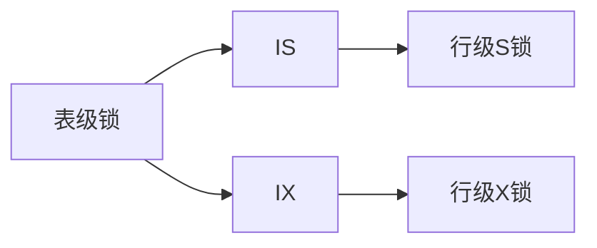

##### 应用场景示例

1. **SIX锁场景**：
   
   ```sql
   -- 事务1：全表扫描后更新部分行
   LOCK TABLE orders IN SIX MODE;
   SELECT * FROM orders; -- 使用S锁部分
   UPDATE orders SET status = 'shipped' WHERE id = 100; -- 使用IX锁部分
   ```

2. **IS/SIX共存**：
   
   ```sql
   -- 事务1（SIX锁）
   LOCK TABLE employees IN SIX MODE;
   
   -- 事务2（IS锁）可同时执行
   LOCK TABLE employees IN IS MODE;
   SELECT * FROM employees WHERE id = 200; -- 允许
   
   -- 事务3（S锁请求）被阻塞
   LOCK TABLE employees IN SHARE MODE; -- 等待事务1释放
   ```
   
   

#### 2. **封锁协议**

| 协议级别       | 加锁规则                | 解决的问题             |
| ---------- | ------------------- | ----------------- |
| **一级封锁协议** | 写前加 X 锁，事务结束释放      | 丢失修改              |
| **二级封锁协议** | 一级 + 读前加 S 锁，读完立即释放 | 丢失修改 + 脏读         |
| **三级封锁协议** | 一级 + 读前加 S 锁，事务结束释放 | 丢失修改 + 脏读 + 不可重复读 |
| **两段锁协议**  | 所有锁在释放前申请（后文详述）     | 可串行化调度            |

---

### 三、并发调度的可串行性

#### 1. **核心概念**

- **调度（Schedule）**
  在数据库系统中，调度指多个事务的操作（读/写）按时间顺序的执行序列。  
  形式化表示为：  
  $S = { o_1, o_2, \dots, o_n }$  
  其中 $o_i$ 是事务 $T_j$ 的操作（$read(Q)$ 或 $write(Q)$），且每个事务内部的操作顺序保持不变。

- **可串行化调度（Serializable Schedule）**
  一个调度 $S$ 是**可串行化的**，当且仅当其执行效果等价于某个**串行调度**（即事务按顺序依次执行）。
  
  * **效果等价**需满足：
    
    * 每个事务读取相同的值。
    
    * 数据库最终状态相同。
  
  * **数学定义**：  
    $S$ 是可串行化的 $\iff \exists\ \text{串行调度}\ S'$，使得 $S \equiv S'$（$\equiv$ 表示等价性）。
  
  可串行化调度分为两类：
  
  * **冲突可串行化**（Conflict Serializable）
  
  * **视图可串行化**（View Serializable）
  
  > **注意**：冲突可串行化 $\subset$ 视图可串行化 $\subset$ 可串行化。$text{Schedule} \, S \equiv S_{\text{serial}} $
  
  

- **冲突操作**：不同事务对同一数据的读写/写写操作
  
  - $` \text{Conflict} = \{ (\text{read}_i(x), \text{write}_j(x)) \mid i \neq j \} \cup \{ (\text{write}_i(x), \text{write}_j(x)) \} `$

#### 2. **冲突可串行化（Conflict Serializable）**

##### 2.1 冲突操作（Conflicting Operations）

两个操作 $o_i$ 和 $o_j$ 是冲突的，当且仅当：

1. 属于不同事务：$T_{id}(o_i) \neq T_{id}(o_j)$

2. 操作同一数据项：$data(o_i) = data(o_j)$

3. 至少有一个是写操作：$ \{ o_i, o_j \} \not\subset \{ read \} $

冲突操作类型：

* $read_i(Q)$ 与 $write_j(Q)$

* $write_i(Q)$ 与 $read_j(Q)$

* $write_i(Q)$ 与 $write_j(Q)$

##### 2.2 冲突等价（Conflict Equivalence）

两个调度 $S$ 和 $S'$ 是冲突等价的，当且仅当：

* 包含相同的操作集合。

* 任意一对冲突操作的执行顺序相同。

##### 3.3 冲突可串行化定义

调度 $S$ 是冲突可串行化的，当且仅当存在一个串行调度 $S'$ 使得 $S$ 与 $S'$ 冲突等价。

* **判定方法**：构造冲突图（Precedence Graph）：
  
  * 节点：所有事务 $\{ T_1, T_2, \dots, T_k \}$。
  
  * 有向边：若 $S$ 中 $T_i$ 的某操作先于 $T_j$ 的冲突操作，则添加边 $T_i \rightarrow T_j$。
  
  * **定理**：$S$ 冲突可串行化 $\iff$ 冲突图无环。

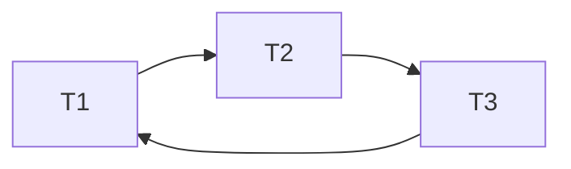

##### 示例

事务：

* $T_1$: $read(A),\ write(B)$

* $T_2$: $write(A),\ write(B)$

调度 $S$:  
$write_2(A),\ read_1(A),\ write_1(B),\ write_2(B)$

* 冲突操作对：
  
  * $write_2(A)$ 与 $read_1(A)$（冲突） $\Rightarrow T_2 \rightarrow T_1$
  
  * $write_1(B)$ 与 $write_2(B)$（冲突） $\Rightarrow T_1 \rightarrow T_2$

* 冲突图：$T_2 \rightarrow T_1 \rightarrow T_2$（有环）→ **非冲突可串行化**。

* * *

#### 3. **视图可串行化（View Serializable）**

##### 3.1 视图等价（View Equivalence）

两个调度 $S$ 和 $S'$ 是视图等价的，当且仅当满足：

1. **初始读一致性**：  
   若 $T_i$ 在 $S$ 中读取 $Q$ 的初始值，则在 $S'$ 中也读取 $Q$ 的初始值。

2. **读依赖一致性**：  
   若 $T_i$ 在 $S$ 中读取 $T_j$ 写入的 $Q$，则在 $S'$ 中也读取 $T_j$ 写入的 $Q$。

3. **最终写一致性**：  
   若 $T_k$ 在 $S$ 中是 $Q$ 的最后写入者，则在 $S'$ 中也是 $Q$ 的最后写入者。

##### 3.2 视图可串行化定义

调度 $S$ 是视图可串行化的，当且仅当存在一个串行调度 $S'$ 使得 $S$ 与 $S'$ 视图等价。

##### 示例

事务：

* $T_1$: $write(A)$

* $T_2$: $write(A)$

* $T_3$: $read(A)$

调度 $S$: $write_1(A),\ write_2(A),\ read_3(A)$

* **视图等价**于串行调度 $\{ T_1, T_2, T_3 \}$：
  
  * $read_3(A)$ 均读取 $T_2$ 写入的值（非初始值）。
  
  * 最终 $A$ 由 $T_2$ 写入。

* **非冲突可串行化**：
  
  * $write_1(A)$ 与 $write_2(A)$ 冲突 → 顺序必须固定。
  
  * 但 $S$ 允许 $T_1$ 和 $T_2$ 的写顺序任意（实际调度中 $T_1$ 先于 $T_2$）。
    
    

#### 4. **两段锁协议 (2PL)**

- **阶段划分**：
  - **扩展阶段 (Growing Phase)**：只加锁，不解锁
    $` \text{Phase}_G: \text{lock}(A), \text{lock}(B), \dots `$
  - **收缩阶段 (Shrinking Phase)**：只解锁，不加锁
    $` \text{Phase}_S: \text{unlock}(A), \text{unlock}(B), \dots `$
- **定理**：遵守 2PL 的调度 $\subseteq$ 冲突可串行化调度
- **变种协议**：
  - **严格 2PL**：X 锁保持到事务结束
  - **强 2PL**：所有锁保持到事务结束

---

### 四、死锁处理

#### 1. **死锁的成因**

- **必要条件**：
  1. 互斥：$` \text{lock}(A) \Rightarrow \text{exclusive access} `$
  2. 请求与保持：$` T_i \text{ holds } L_1 \text{ and requests } L_2 `$
  3. 不可抢占：锁只能自愿释放
  4. 循环等待：$` \exists \{T_1 \to T_2 \to \dots \to T_n \to T_1\} `$

#### 2. **死锁解决方案**

| 方法        | 原理      | 实现方式                                                                            |
| --------- | ------- | ------------------------------------------------------------------------------- |
| **预防**    | 破坏必要条件  | 事务开始前申请所有锁（破坏条件2）                                                               |
| **避免**    | 动态检测安全性 | 银行家算法：$` \text{Max}_i \geq \text{Alloc}_i + \text{Req}_i `$                     |
| **检测与恢复** | 定期检测死锁  | 构造等待图 $` G = (V, E) `$<br> $` E: T_i \to T_j \iff T_i \text{ waits for } T_j `$ |
| **超时机制**  | 实践常用方案  | 设置锁等待超时阈值 $` t_{\text{timeout}} `$                                              |

#### 3. **死锁恢复步骤**

1. 选择牺牲者：最小化代价（如事务进度）
2. 完全回滚：$` \text{Rollback}(T_{\text{victim}}) `$
3. 部分回滚：回滚到足够解除死锁的点
4. 重启事务：$` \text{Restart}(T_{\text{victim}}) `$
   
   

#### 4. **死锁预防原则**

1. 锁获取顺序：
      表级IS/IX → 行级S/X → 表级SIX

2. SIX锁优化：
   
   * 避免先加S锁再升级IX锁
   * 直接请求SIX减少死锁概率

---

### 关键知识点总结

| 概念   | 核心机制  | 数学表示                                                                                                                   |
| ---- | ----- | ---------------------------------------------------------------------------------------------------------------------- |
| 并发问题 | 读写冲突  | $` \text{write}_i(x) \parallel \text{read}_j(x) `$                                                                     |
| 封锁协议 | 锁兼容矩阵 | $` \text{S锁}: \begin{bmatrix} 1 & 0 \\ 0 & 0 \end{bmatrix}, \text{X锁}: \begin{bmatrix} 0 & 0 \\ 0 & 0 \end{bmatrix} `$ |
| 可串行化 | 前驱图判定 | $` \text{Acyclic}(G) \iff \text{Conflict Serializable} `$                                                              |
| 两段锁  | 阶段约束  | $` \forall T,\, \text{unlock} \prec \text{lock} `$                                                                     |
| 死锁   | 循环等待  | $` \exists \text{ cycle in } G_{\text{wait}} `$                                                                        |

> **注**：现代数据库（如 PostgreSQL）采用 **MVCC（多版本并发控制）** 结合 **SSI（可串行化快照隔离）** 实现高效并发，减少锁的使用。
